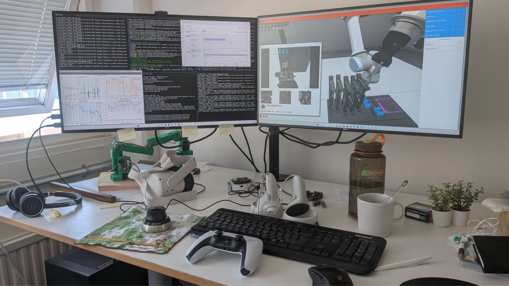
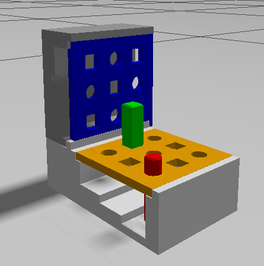
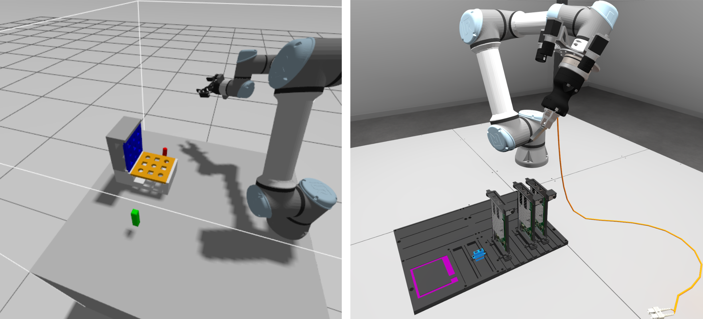
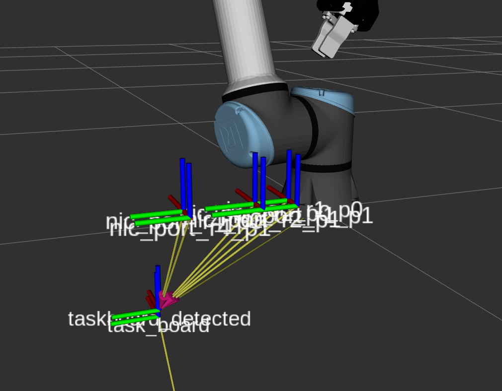

[{width=100}](ai_industry_challenge.md)

_My very first official assignment with McGuire Robotics AB was joining team b-robotized in the AI for Industry Challenge, an open competition by Intrinsic about automating electronics assembly with a robot arm. In this post I'll go through how we detected the task board with ROS 2 and some good old OpenCV, how I ended up as a robot arm tamer with a PlayStation controller, and what we took away from it once we didn't make it into the next phase._

<!-- more -->
{width=500 .center}
*
Which controller to pick to train the robot with?!
*

So my very first assignment officially with my newly started company McGuire Robotics AB was joining team [b-robotized](https://en.b-robotized.com/) at the [AI for Industry Challenge](https://www.intrinsic.ai/events/ai-for-industry-challenge). This was an open challenge organized by Intrinsic (now part of Google), where anyone could participate. It was all about automating electronics assembly, in this case a simulated server slot assembly, where the robot arm had to manipulate flexible cables and insert plugs. Mostly tailored towards roboticists, but in practice also data scientists, AI engineers or embedded developers could have their first go at robotics with this challenge.

## Preparing for the qualifying round

We already started working on the challenge early this year, around February, where we looked at existing tools that could prepare us to get fully into the challenge later on. We had figured that the UR5e arm was most likely going to be used, so we got a Gazebo simulation started up with a standard gripper (the Robotiq one). We managed to get 3 cameras on that arm and experimented with a task board that is a bit more familiar, which is basically just a [peg-in-hole type of task board from the NIST standard models](https://github.com/usnistgov/robotpeginhole). 

{width=500 .center}
*
The offical NIST pegboard but adjusted for Gazebo Ionic.
*

We had no idea what would be provided during the challenge, so we also connected the arm with MoveIt and made sure it could be controlled with impedance control and with a Cartesian target. This was also important groundwork for implementing HIL-SERL, human-in-the-loop reinforcement learning. That was our main trump card for the final insertion, arguably the most difficult part of the challenge.

My main goal was to set up the simulation for learning, and to potentially look into NVIDIA Isaac or MuJoCo. Also, simulating flexible cables is an entirely different thing altogether, so that would take quite some time to implement as well.

Once the [toolkit](https://github.com/intrinsic-dev/aic) came out, we realized that many of the things we had tried to implement before were already available. It was ROS 2 based (Kilted with Gazebo Ionic) and came with a fully working and controllable UR5e plus gripper (albeit a much simpler one), together with the entire framework and task board already simulated. It even came with a Cartesian controller with impedance control included, so all that preparation work turned out to be unnecessary in the end. We eventually decided not to go the NVIDIA Isaac route, mostly due to the difficulty of running that on everyone's machine, but also because we found out that the evaluation of the qualifying round was mainly done in Gazebo.

*
The UR arms we prepared before the qualification phase and the official AIC toolbox arm. 
*

This meant that my role as chief of simulation got a bit diminished, since the full platform was already there. However, I do have a lot of perception experience from back in my Master's and early PhD projects. To some of the developers nowadays my computer vision knowledge is perhaps considered 'old school', but I must say it was very satisfying to jump back into OpenCV and use those old muscles again. And it can be very powerful too.

## What were we actually scored on?

Before diving into the detection, it's worth knowing what the [scoring](https://github.com/intrinsic-dev/aic/blob/main/docs/scoring.md) looked like, because it explains a lot of the choices we made later on. Each trial was worth 100 points, and there were 3 trials in the qualifying round. The bulk of that, 75 points per trial, came from getting the connector fully inserted into the correct target port, verified with contact sensors. If you didn't manage a full insertion, you could still get partial credit based on how deep the plug got or how close it ended up to the port.

The rest was about the quality of the motion. Task duration was worth up to 12 points, with the maximum awarded for anything under 5 seconds and nothing at all past 60 seconds. On top of that there were points for trajectory smoothness and path efficiency, and penalties for pushing harder than 20 N during insertion or touching anything off-limits like the enclosure or the board itself.

So: get it in, get it in fast, and don't bump into things. Check!

## Task board detection

So initially I focused on the first part of the task, which was detecting the pose of the task board and orienting the arm above the location of the ports. The idea was that if we could detect the full pose of the task board, we could do the logic later of where the actual components were. This was all to retrieve the actual 3D pose of the port that the gripper needed to move towards and get as close as possible to, so that the reinforcement learning policy could take over.

The whole thing was built as ROS 2 nodes around OpenCV, and everything ended up in the TF tree: each camera published its own `camera -> taskboard` transform, and the final verified pose and the detected ports were published as transforms too. Here is the full pipeline:

![Diagram of the task board detection pipeline, showing three wrist cameras feeding into per-camera preprocessing (color logo filter, binary image and morphological filters, Canny edge detection, gripper mask removal), then per-camera task board transform estimation (Hough/RANSAC line fit, intersection corner detection, rectangle corner fit, orientation estimation and SolvePnP), then a pose verification stage that compares and averages the three transforms, and separately a YOLO branch detecting SC and NIC ports which are projected into 3D via zone intersection. The result feeds the pre-insertion control which hands over to the HIL-SERL policy.](images/taskboard_detection.png)
*
The Taskboard detection schematic that we initially had
*

The first thing I thought about was to make a binary image of the task board by thresholding its gray scale image against its much lighter background. Then some clean up of the artifacts (like the light lines in the back) by eroding and dilating the binary image with morphological filters, plus masking out the gripper itself, since it happily shows up in the camera view as well. Then to retrieve the edges with Canny, and fit lines on those edges with Hough lines and RANSAC filtering. Where those lines intersect, you get 4 corners, even if those corners could not be seen by the camera because it was too close by. The flat square was then projected using the camera info with the SolvePnP algorithm, to retrieve those points in 3D space and hence get the 3D pose of the task board. Of course you'd have rotation ambiguity as well, so luckily there was also a nice magenta logo that gave some clarity on that too.

The obvious question here is: why not just slap an AprilTag on the board and call it a day? Well, we weren't allowed to change anything about the scene or the task board, so classic vision it was.

The cameras themselves were 3 wrist-mounted ones, and were fairly low-resolution. On a clean, empty task board the detection usually works pretty well on a single camera. However, on a more cluttered task board with NIC cards in it, you'd find more squares than only the task board itself. So the projection was validated with all 3 cameras: their individual transforms were compared on rotation and distance, and if they agreed within a certain tolerance, an averaged transform was published in `base_link`, with a flatness correction on top. Perhaps a Kalman filter would have been sufficient, but out of all the detections it did, there was maybe 1 in 100 where it saw a different square somewhere else, and when it did detect the right one it was usually accurate to the millimeter, which was definitely good enough!

*
The processed images of the taskboard and component detection
*

The port detection itself was done with quite a different technique, namely YOLO, with separate detectors for the SC ports and the NIC ports. This was the task of my teammate Yara, who handled the whole training framework. Basically she set up the simulator to generate all possible positions of the task board, and retrieved the port locations in those images by using the available ground truth transforms and semantic fill-in and clustering. You should definitely ask her for the specifics! But of course, these detections were only done in 2D on a single camera. However, now that the pose of the task board was known, we could project the task board zones. And if you imagine a ray beaming from the camera through the component, and intersect that beam with the projected zones, then voilà, you have a 3D pose, published as a transform for the next stage to pick up.

{width=500 .center}
*
The detected taskboard and ordered components. The ground truth taskboard can be viewed on the bottom
*

## The pre-insertion method

So the task board and component detection solved about 95% of the total movement, namely positioning the arm directly above the port for the trained HIL-SERL policy to take over. In order for the robot to determine the full task board pose, it was necessary for it to first rotate the camera into the direction where it could see that binary image (or blob), then check for the task board TF, move above the target rail and finally move the gripper above the port. And that took extra time, plus a risk of the cable getting tangled and stuck. Remember, we had to finish the task within 5 seconds to get the full amount of points

Even though I really liked the solution we had, at one point we took a shot at a much simpler approach: getting the 3D pose of the components by simply intersecting with a plane offset from the table plane. Since it was possible to also infer the orientation of these components, that should work GIVEN that there were only a few ports in view. But with those restrictions, it would be possible to have a one-shot component detection that skipped the task board step entirely.

*
The Taskboard detection schematic we ended up with at the end of the qualifying phase
*

The rules for the qualifying round indicated that the target components were visible in at least one of the cameras attached to the robot arm. So after trying the more elaborate task board detection in the pre-insertion strategy, we went for a hybrid approach. If it saw more than 2 SFP ports on the NIC cards (or more than 2 SC ports), it would use the default: rotating, but with a full task board pose detection. Below that threshold it would use the simplified one, skipping the task board and going straight from YOLO to the 3D detector.

Of course, we weren't able to see any video or logs from the online submission, but purely from the time the arm took to complete the task, we could already tell that it was always seeing fewer ports and therefore always selecting the easy 3D component approach. That's when we fully skipped the default task board pose search (nooo, my darling!) and took the full risk of only using the lightning fast, one-shot component detection, which we could then fully optimize for speed to get the plug as close as possible for HIL-SERL to take over. And that paid off: we scored 250 out of 300 points and ended up in 10th spot out of the 160 teams participating in the qualifying round. 

Here is a [nice video shared on Linkedin](https://www.linkedin.com/posts/knmcguire_opensource-robotics-simulation-ugcPost-7463186455167754240-MyES/) on our entire approach:

<iframe src="https://www.linkedin.com/embed/feed/update/urn:li:ugcPost:7463186455167754240?collapsed=1" height="542" width="504" frameborder="0" allowfullscreen="" title="Embedded post" align="center"></iframe>

For phase 1 (the round after the qualifying round), we decided to go for a different pre-insertion approach altogether, also since we completely realized that our lightning fast solution was not able to make the cut (and perhaps the first one was perhaps a bit overcomplicated). We were allowed to use Flowstate, the development environment made by Intrinsic, and we ended up leaning on their vision model for the initial task board and component detection instead of our own. I can't say much more about that part, as that falls under the agreement we signed. What I can talk about is the one element that stayed consistent through the entire competition: the plug insertion policy with HIL-SERL.

## Becoming a robot arm tamer

[HIL-SERL](https://hil-serl.github.io/) stands for human-in-the-loop sample-efficient robotic reinforcement learning, and the short version is that instead of waiting weeks for a policy to stumble into a reward by chance, you sit next to the robot and correct it while it learns. You record a handful of demonstrations, and from there the policy trains while you intervene whenever it is about to do something useless. I won't go into the inner workings here, since the [paper](https://hil-serl.github.io/) explains it far better than I can, and this was really my teammate Jennifer's domain. She built the whole framework and learning environment for our team and trained the initial policies, and she deserves all the credit for that part.

Because Yara and I were fully occupied with the pre-insertion strategy during the qualifying round, that also meant Jennifer had to battle the robot arm dragon entirely by herself. It was only in phase 1, once the port approach was finalized, that I could finally join her.

But first I had to pick a weapon. You spend hours supervising this thing, so the teleoperation device matters much more than you'd expect. I started out with a keyboard, which I can now confirm is a terrible idea: I could still feel the cramps in my hand that same evening. A SpaceMouse (Jennifer's choice) and a Quest 2 were also on the table, but in the end a PlayStation 5 controller worked out best for me. Two analog sticks map surprisingly nicely onto nudging a gripper around in Cartesian space, and I could hold it for hours.

Then the actual taming begins. You record something like 20-50 demonstrations of a successful insertion, and after that the training starts with both the learner and the actor running. It uses those demonstrations, but it also learns from every intervention you make along the way, where you steer the gripper towards a pose that is more likely to get that juicy reward. In our case the reward was only given on a full insertion, which we detected through the proximity of the contact point at the bottom of the plug. For observations we used the camera images together with the force-torque sensor, and the policy commanded the Cartesian target at 10 Hz, which was as fast as the toolkit allowed us to send motion commands anyway. All of this ran in Gazebo on Windows 11 through WSL, which honestly held up better than I expected.

See here for a [linkedin post](https://www.linkedin.com/posts/knmcguire_robotics-aic-physicalai-activity-7482816353087844354-Qzas) about the progress made:

<iframe src="https://www.linkedin.com/embed/feed/update/urn:li:share:7482816351087284224?collapsed=1" height="543" width="504" frameborder="0" allowfullscreen="" title="Embedded post"></iframe>

Getting to the first autonomous insertions took a good 2-3 hours of intense, uninterrupted training and intervening. After that it becomes a slow game of letting go: you taper off the interventions, then start being deliberately 'disruptive' with them, and you increase the randomization in the scene. Doing that for a single policy could easily take half a day to a full day. And I was definitely too eager at some points: crank up the scene randomization too quickly, and the policy just collapses and confidently learns something completely wrong instead. Then you get to start over. Only once it stayed successful for a good long stretch without me touching anything was it time to select that policy and try it in the 'real world'... and with real world we still mean simulation.

## In the end, everything really matters

<iframe src="https://www.linkedin.com/embed/feed/update/urn:li:ugcPost:7492567322021380096?collapsed=1" height="542" width="504" frameborder="0" allowfullscreen="" title="Embedded post"></iframe>

For the second phase we sadly didn't qualify anymore. Unfortunately it is hard to say what the actual cause was, or where we diverted from a potential winning path, as both the new pre-insertion and the extra trained policy didn't make the cut. Phase 1 was significantly harder, as we had to plug in 5 cables (so 10 insertions) instead of just one plug at a time. On top of that, HIL-SERL is a technique meant for real arms and meant to be trained live. As the competition went along it became clear that we probably wouldn't be able to get that special treatment with 9 other teams competing. So perhaps we should have focused more on the immediate transferability of the simulated policy to real life, and that is perhaps not something that has been done with HIL-SERL (yet)! But these are all just assumptions.

Most of what we built in phase 1 is difficult to release, but I have been cleaning up and recreating the task board pre-insertion part, both the old full-pose detection and the newer one-shot version. You can find that here: [ADD REPO LINK]. But just keep in mind, I won't be maintaining it ;) It will be just like a beautiful, overcomplicated drawing on my refrigerator (look mum, what I made!), but GitHub edition. For the HIL-SERL part, that will take more time from the entire team to be able to clean it up and release it together. However, I definitely would recommend checking out the [Hugging Face version of HIL-SERL in MuJoCo](https://huggingface.co/docs/lerobot/v0.4.3/en/hilserl_sim).

But you can check out a video compiled by B-robotized what we worked on during the competition as well here:

<iframe src="https://www.linkedin.com/embed/feed/update/urn:li:ugcPost:7493999374163902464?collapsed=1" height="542" width="504" frameborder="0" allowfullscreen="" title="Embedded post"></iframe>

Nonetheless, this definitely doesn't mean that we left the competition empty handed. For me personally, this was the first time I ever worked with a manipulator, even in simulation. Sure, I learned the theory, including impedance control, during my Master's, but I had never applied it. This was also the first time I worked with applied, 3D reinforcement learning, other than the simple flat 2D grid exercises we had to do back then. And it was a way to get back in touch with my old friend OpenCV, which I used to use so much back in the day and will definitely be picking up again.

That is also the thing that surprised me most. A robot arm is a seemingly completely different platform from the quadcopters I've spent most of my career on, and yet so much of it carried straight over: the state estimation intuition, the computer vision, the coordinate frames, the debugging habits. Nothing I had learned turned out to be wasted. And I guess if you know ROS, that definitely helps too.

Moreover, working together as a team of equals to solve a difficult robotics problem like this has been the most satisfying part of all. Working with Yara and Jennifer has truly been a pleasure, and even through the stress and hardship of the many deadlines, we did deliver something that we all did together as team b-robotized. I hope I'll be able to be part of many teams like this in my consulting days to come.

