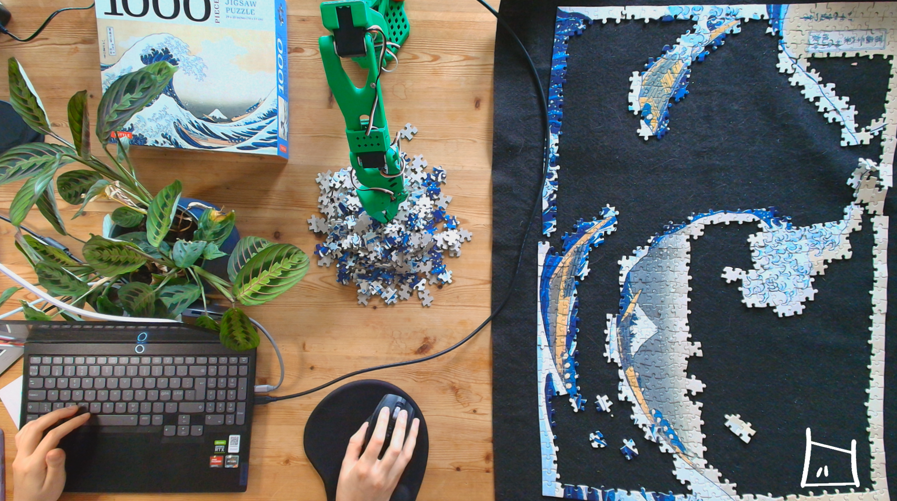

[{width=100}](freelancing_6months.md)

_test test_

<!-- more -->

It has been a year since I decided to give 

## Officially started McGuire Robotics

With my half year blogpost I already mentioned that perhaps I'd like to take a more official step towards freelancing. 
I was freelancing through a freelance proxy company that at least enabled me to just 'try it out' and prevented the long tedidous start up time that usually takes to start up a company her in Sweden. Now that I am more sure that I'd love to become independent and self-employed, and actually taken a course in it (fully in Swedish as I may add, don's ask how much I actually caught on on it), it was time for the next phase... starting up McGuire Robotics AB.

One of the question that was asked to me, of why I started an aktie bolaget (AB, equivelant of a Ltd), and not went for an enskild firma (equivelant of an sole propriertership), there were a couple of reasons for it. First of all, I like the seperation of the business and me, not only in terms of load but also in terms of potential liability. In robotics consulting, it will be a risk to make yourself personally liable for any damaged casused by your software intergration. Ofcourse, anything is ensurable, and the contracts can be absolutely watertight, but I didn't feel comfortable of not having the extra layer of projection. Moreover, I've also heard from some clients, both Swedish and foreign, that due to that risk as well that they prefer to work with limited companies due to that risk.

Moreover, one of the most important things that I value for freelancing is independence, and if at one point I'd like to hire people for my company, I'd love to have the ability to do so. If I'd like to develop games, or apply for a research grants (which here they only give out to limited companies), I'd like to be able to do so as well. The sole propiertaryship seemd to be a little bit too restrictive for my possible plans for the future. 

But still I won't lie, going for a limited company required A LOT more paperwork and requires much more administration. I did hire an accountant and a laywer to help out with some legal stuff so it wasn't that I was working on it solely by myself, but I did sometimes question if this all was worth for the projects that I am actually working on and my immediate plans to be still a 1-person company. But with that behind me and the avenues of possibilities still open me for the future... I would say that it definitely is worth it!

## Manage my workload

One of the major things that I have learned, and am still learning... and probably will continue to learn is the future is how to balance my workload. When I just started out, I had a lot of free time to work on my own projects and occasianally blogpost about it, but as I got a couple of assignments, I just got sucked in that and really didn't have any time for the other things at all. Eventhough I did set a clear goal for myself to be able to still have space to creatively expand myself and take courses, that went down the drain as soon as there was a little big timepressure and stress involved.

This is a true reality for freelancers, and I've heard many cases of burnout with my fellow independent freelancing colleagues. I do think this is mostly due to having too many things on the plate, for which I derinitely am very much guilty for. Last year I travelled way too much, forced myself to content create regurally, and juggling 2/3 assignments at the same time. That is way too much, and I can not multi-task (that wasn't a suprise to me but at least there is comfirmation)

What I did enjoy, of both my personal projects and client projects, is a good deticated time that you can just deep dive into something that is very mentally challenging or just simply fun to (english word for uitpluizen). I could get lost and obsessed for something like that for weeks at end. And that usually a blogpost that comes out of it was usually ver well received and sometimes even result into projects itself. I think that probably I will need to be able to plan in that in.

## What happened to the content!?

Yes... see the above section. Last year I tried to dedicate time to do twitch streams on programming, with my work with O3DE or the robotic builds I did. To do that consistenly while having time pressure of other projects, really kills creativity and motivation. So the basic answer is, that I simple didn't have the motivtion to stream/write blogposts/make videos and deep dive into projects. 

Ofcourse, I am self-employed now, so I need to be mindful. If I could work a 100% of my time on opensource and personal projects I would most definitely only do that. But... I'd also like to get a salary. Ofcourse I will only take up assignments that I know well and enjoy doing, but there is just something different about what you want to do personally, what you can do to help others in an community, or what the client wants you to do.

How to strike a balance in that is very difficult, but also very important. The content I have created have done very well in the past, mostly those that I was able to have dedicate focus time on it. The ROS2 windows video I made last summer now has over 4000 views (didn't generate leads but at least useful to the community). The Simulation ranking list I did has hit over a 1000 stars and actually has generated some leads and assignments. 

A wise bearded bald man told me once: "As a freelancer, your main job are not your contracts, but the contentcreation that that generates the leads"

I should actually dedicate time on my schedule to do these projects in combination with my assignment jobs... but perhaps not in parallel, but in sequence as dedicated project slots

## Emerging deeper into Open-Source community

My ros2 on windows work did also result in something intersting. As I mentioned, my ROS2 on windows video and talk were pretty populair, and then I got the question from the infrateam from open robotics if I might consider joining. So I went through the mentorship trial and actually am an official committer at the infrastructure team currently! The idea is to improve the situation on ros2 on windows 11 mostly, but eventually I should also be able to help out with a more variety of problems as well on more parts of the infrastructure.

Also, I'll be co-mentoring 2 Google summer of code students! For 2 projects namely the improving Colcon Mixin project together with Scott Logan (Infrastructure Lead) and Performance test CI intergration together with Skyler Meiders (ROS2 PMC memeber). Both quite infrastructure heavy and therefore also good oppertunity to really get into the mechanics of it all. Luckily ROS2 lyrical luth distro will be out then, and it will be summer, so maybe people won't mind if I break stuff :P (just kidding of course!).

I have tried to also start something up here in Malmö itself, as I do miss the nice interactions I have at ROSCons sometimes. 

