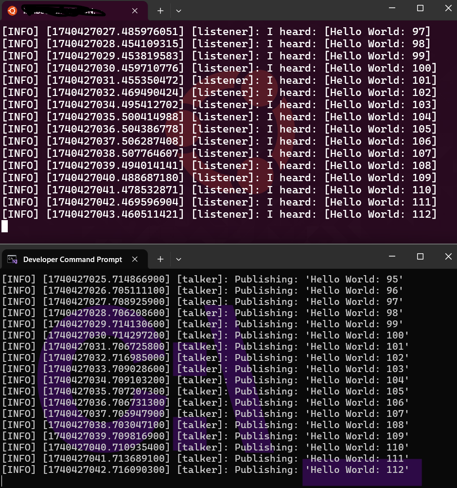

[{width=100}](windows_with_robotics.md)

_Six months into my freelancing journey, and I'm still getting more questions about being self-employed than about my actual robotics work! From navigating intermediary companies to managing anxiety, from streaming experiments to juggling multiple assignments—here are the honest lessons I've learned so far. Spoiler: Past Kimberly was perhaps a bit too ambitious with those talk applications..._

<!-- more -->

Has it been six months already?! I can't believe how fast time has flown since I [decided to try out freelancing and being self-employed](https://www.mcguirerobotics.com/blog/2025/04/10/flying-solo/). Still, I'm surprised by the number of questions I get from various people about my experience. When I was just at ROSCon UK in Edinburgh, I was expecting more questions about my aerial robotics work or my lightning talk about simulators, but 90% of the questions were: "How is it to be a freelancer?" and "How do I become one?" My general response is to ask me again in a year, as it still feels like I just started... but I guess I've learned a thing or two already that I can share.

## How to Freelance, Though?

When I started in April, I felt that I still needed to try freelancing out in a more casual atmosphere. Since in Sweden it's quite the process and responsibility to start your own company (even as a sole proprietorship), I felt it might be best to use an intermediary freelance company (_egenanställd företag_ as it's called here in Sweden). This means I can still find and communicate with my own clients, but all agreements and invoicing go through one of these registered companies, which handles my salary according to Swedish law, and I can make use of their insurance too. This, of course, goes for a certain percentage of the earnings, which makes perfect sense.

Now, at least, I feel more certain that I would indeed like to continue being self-employed. The intermediary company has worked out so far, but it's limiting in what kind of agreements I can take up, what kind of risk I can take for assignments, and which clients I can take on. It was never meant to be a long-term solution, just a way for me to test the waters before I take the plunge. And in that, it has succeeded.

So I've decided to take my journey one step further into the void. Last month I completed a course on how to start up my own business in Sweden, and I'm currently reviewing and finalizing my business plan. Next up is to start registering and signing up for a business account, bookkeeping service, tax registration... the works! So if everything goes well, I'll have my own actual company to start freelancing from in February 2026!

## Know When to Start

Interestingly, when I started in April, I knew from other freelancers that it usually takes a few months before you could actually sign on and start with assignments. "Perfect!" I thought, because then I can get started and have the full summer to work on these assignments. I might have been a little optimistic...

Getting leads and actually getting to a point where agreements have been signed and project budgets have been accepted... takes time! And you really have to keep reminding your clients (and intermediary company in my case) to give updates and to try to finalize things. In the end, for me, that meant I went into the summer without any assignments to start with, and once summer starts... things slow waaaaay down. Especially here in Sweden, but that also holds true in other countries as well.

In hindsight, a tip I can already give people: think about your timing. I thought the end of April was a good time, but summer was already around the corner and nobody will start anything new. If anything, try to announce your freelancing either at the end of summer or in January, if you have the luxury to choose your start date at least. Luckily, this did give me time to work on personal projects and try some things out with content creation.

## Trying Out Streaming and Content Creation

I did have quite some time to work on my own projects during this slow period, and this was also the moment where I decided to try out... streaming! So there I went, first with a couple of streams about ROS-Gazebo on Windows and WSL2, and then some tutorial streams about working with O3DE. With the latter, since I didn't know it that well yet, I thought perhaps the best way to learn was to do a project and present that project in tutorial style, live, on a stream.

I do find learning quite important, and if I can combine this with showing things on a stream, then I can do two things in one go. However, at the time, I already saw that (1) learning about a new framework, (2) working on a project, (3) preparing a tutorial, and (4) presenting this material live... is a lot of work... and not sustainable if I would actually start with assignments myself.

I still stream to this day, but I've converted to a format that's called "Lofi builds." I don't take people by the hand through a project anymore, but it's just me working on these projects on a table with some music in the background. Less preparation, nice music, and it still forces me to learn something or to advance in a project at least (albeit at a lower pace than the tutorial frenzy I did before). Maybe not the most exciting content, but this is something that works very much in my current schedule, and I guess that's the most important thing... to have something that you can keep up with in the long haul.

## So Many Types of Assignments!

When I started freelancing, I was under the impression that it would mostly be hourly-based technical consulting, where companies charge me by the hour at a certain rate. However, now that I've actually signed several assignment types, I've come to realize that there are very different formats.

Yes, one of my assignments is an hourly rate-based type of gig, but all the others are fixed price upon delivery, either for a full report or for a piece of finished code or node. It would perhaps make sense that a company would like to know the price of the whole lot so that it would be easier to budget it in, right?

Moreover, the range of assignments is very different. In one assignment, I get to work with the code and telemetry of an actual robot, but another assignment is a research assignment with a report as the deliverable. Another assignment is about writing a course about a topic of my expertise, and there have been several article-writing offers as well. It (happily) surprised me that there is such a variety of gigs you can take on.

## Dealing with Time

On one end, I did like that I had a lot of free time during the summer to truly work on my own projects or to help out others in certain open source projects. On the other hand... I'd also like to have a salary as well. Once I had those assignments planned in, I quickly realized that time wasn't my friend and that I had to step down on many of these side things that weren't paid.

All in all, in hindsight, three assignments at the same time for just starting out is too much. I thought I was smart that I could at least start with one of these already in the summer, but as you read before, that didn't really work out. Also, context switching is not something I'm very good at, so I need some good time to focus on one task before moving to another—like a good few days in a row. Luckily, I'm very fortunate that my clients are very understanding and that I was able to push some deadlines a bit later.

Also, the trips I had planned (and are coming up) are also something that really takes time. Yes, it's important to show your work off and show your expertise, but preparing for these talks takes time (and always more than you think). Especially... when they're pretty much all about a different topic... Past Kimberly was perhaps a little bit too ambitious with all of those talk applications... and didn't realize what would happen if they all got accepted (whoops!)

In that sense, it's all part of the process. At least I'm glad that I didn't start out yet with registering my own company so that I could figure it all out at my own pace. I'm sure that a future blog post of mine will tell you all about the amount of time I'm losing just on administration and bookkeeping alone. 

## Dealing with Anxiety

Starting to freelance, or starting your own company, there is one thing that many don't mention you will need to take care of: your anxiety. To start something that will not ensure financial stability (at least at the start), where you are not sure if you will be in demand, and where there are so many unknowns... these are nice fuel for this little monster (remember Anxiety from _Inside Out 2_?)

Even though it's not as bad as it was, I for sure had a lot of moments of "will I have enough assignments?", "is my focus in the right direction?", "is this still something that I'll be enjoying in a year?" or most importantly, "am I doing a good enough job for my client?" Especially when there are so many projects happening in my head at once, it's difficult to not be too overwhelmed. Especially when you already have a bad case of impostor syndrome (PhD of what?)

What helped me was to have a certain type of acceptance of observing that this is hitting me and having a toolbelt of actions you can do. Do I have a down day? Maybe I'll work on an assignment that is just your typical grunt work. Do I feel I've been working on the same piece of a problem? Step back and work on my robot arm for a while. Also, communicating with your client to make sure you're on the same page is quite important as well, as it's not only for your own anxiety, it's also for theirs, so communicating about your process is important.

Anxiety and independence are part of being a freelancer. Remembering why you're doing it and which projects or prospects excite you is something that you can at least tame your anxiety with. I'm still learning to enhance my toolkit, but I'm improving a lot!

## To Conclude

Yes... six months went by so fast, but looking back, I guess I've already learned a lot! And there have already been quite a lot of projects I've been involved with. Basically, I'm starting to learn about entrepreneurship, had my first hand at content creation, learned about what types of assignments or opportunities there are, and I'm getting better and better at managing both my time and anxiety.

I do note that I'm quite the open book with these kinds of things, and can only really give my honest opinion and experience on my current freelance adventure. I hope I didn't put anyone off with this blog, but yes, freelancing might not be something that everyone will be ready for.

For me, if you ask me if I regret my decision, I absolutely do not. Yes, there are many things I'm still unsure about, but this prospect of independence and the possibilities that come with it is something that is very exciting! 