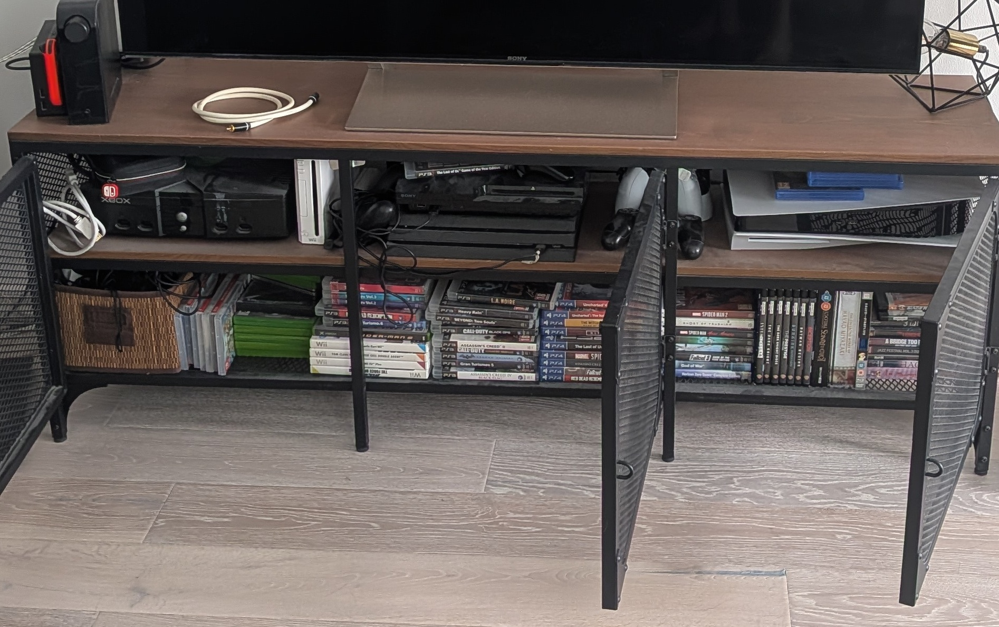

[{width=100}](game_development.md)

_I've spent the past year co-working at a game development hub, which is a slightly odd place for a robotics engineer to end up. But the more time I spend there, the more overlap I see between these two worlds, and the more I appreciate the differences. In this post I ramble a bit about gaming, modular design, the state of the industry, and whether I should ever try making a game myself._

<!-- more -->

___

A robotics engineer walks into a game development hub. It sounds like the setup to a joke, and honestly, for the first few weeks it kind of felt like one. But a year in, I'm still here, still learning from the people around me, and increasingly convinced that these two fields have more to say to each other than either side realizes. So let me tell you how I got here, and what I've picked up along the way.

{width=500 .center}
*
My games and console collection, and there's more in the back... I might have a problem :sweat_smile:
*

## Ever since I was little

For as long as I can remember, I've been gaming. Perhaps it started when my older sister let me play on her Game Boy when I was just a few years old, and that got me hooked for good. Who knows, but one of my most vivid childhood memories is playing Donkey Kong on the Super Nintendo we got at home when I was around six.

Gaming has been my most consistent hobby by far. Other sports and hobbies came and went (although I played tennis for 25 years, I hardly pick up a racket these days), but gaming stayed. I still mourn the SNES, PlayStation 1, and Game Boy Advance that my parents sold at a flea market on Dutch Koninginnedag, so now I hold on tightly to my consoles! Currently I'm the proud owner of a Nintendo Switch, a Wii, an original Xbox, a PlayStation 3, 4, and 5, and a Meta Quest 2, along with a solid selection of what I consider the best games per platform. Whenever my husband complains that I maybe have 'too many' machines taking up space in our TV cabinet, I triumphantly point at his LP collection of 200+ records, 4 guitars, and a huge amplifier taking up arguably more room. A hobby is a hobby!

So when I decided to go freelancing a year ago, it was already clear to me that I needed a space to work alongside other people, and the Game Habitat is where I ended up looking. Partly because a lot of the robotics simulators we use are inspired by existing game engines, and partly because, as a self-proclaimed game geek, I was genuinely curious what the game development industry was actually like on the inside.

## Where robotics and games meet

What I was really after are the connections between robotics engineering and game development. Usually when you sit in between disciplines and manage to connect them, that's where you discover new things. Ever wonder where behavior trees come from, now so widely used in robotics autonomy? That's right, game development.

The first similarity I kept bumping into is the push toward modular design, whether that's the robot or the game. In game development, this is largely because games are built by very big and diverse teams. There needs to be space for technical artists to work, for gameplay and level designers to move things around easily, and for programmers to integrate more tools and plugins. The game engine is the glue that binds all of it together.

That got me thinking about the original purpose of ROS, the Robot Operating System. Robotics teams may be smaller than game studios, but when ROS first started out, the focus was on reproducibility of open-source packages between academic and research groups, so that others could reuse code developed elsewhere. So even though the individual teams are smaller, the global open-source community is huge, and in a way you can think of that as one giant distributed team.

## Where they part ways

The biggest difference I see, though, is the interaction. In robotics, the main focus is designing a system that can accomplish a task as efficiently and quickly as possible, with human interaction playing a secondary role. If a robot isn't safely tucked behind a big cage with a red button, it needs to be safe around humans. Autonomous vehicles in particular should stop for any cyclist. But that's not what they were designed *for*; the main purpose is simply getting from A to B.

Almost all games, on the other hand, are designed to entertain the human. They're not made to solely stress-test your GPU. Every control input, autonomous NPC, and level is centered around the player. If it isn't smooth, fast, and most importantly *fun*, no one will buy the game, and that's that. This is why playtest sessions are a mandatory requirement for any successful game, where playtesters who aren't part of the team (or family!) play with as few instructions as possible. In industrial design engineering (from what I can still remember), we called this user testing.

Oh, and sound and music design is hardly a thing in robotics... but call me up if you ever need a robot foley artist! I'd love to do a gig like that.

## The future of games

If you're a gamer yourself, you'll know the game industry is going through a real transition right now. A lot of lay-offs are happening, here in Malmö too, and it's been going on for a good few years. So maybe I joined the Game Habitat at the wrong time... but at least they had a spot for me. And is it really such a bad time to get into it?

Because of my tendency to sit in between disciplines and be a bit of a constant outsider, I was asked to join the Future of Games workshop core group organized by Media Evolution here in Malmö. There we tried to look beyond the thunderclouds of current affairs, imagining a world where games are perhaps a more integrated part of our lives. Will the industry recover, grow bigger, or become more local and decentralized? Who knows! Either way, it was really nice to be in a room with people who were gaming fans, developers, or working in adjacent fields, all wishing for these wonderful things to keep going.

## So... should I make a game myself?

That's a thought I've carried around for years, especially back when work situations got tough. I'm definitely not trained for it, but looking at the individual skillsets involved in robotics engineering, there are here and there some transferable parts. Especially since I started out in industrial design, so I understand the human-centric side and can even do a bit of graphic design myself.

But making a full-fledged game from start to finish requires a level of dedication, vision, and focus that's on a whole other level. Maybe things are a little easier now with AI tooling, but you still need the full understanding of how a game comes together, namely the game design itself. I've tried a few small things here and there on different engines, but I'm not sure I'd even call them games. What I *have* definitely gained is a newfound respect for solo indie developers.

Realistically, if I wanted to make this a career, there's a whole stack of courses I'd need to take and a serious chunk of time (maybe a year) I'd have to dedicate to deliver something even remotely playable. That would mean setting aside my robotics engineering and the great open-source community that comes with it, and I have the feeling I've only just really gotten started there! It would also mean tapping into my personal time, which means I wouldn't get to actually *play* games anymore. Not exactly the dream.

## Being part of it anyway

So maybe I let go of the ambition of becoming a game developer myself. That doesn't mean I can't be part of the scene. Indie studios are popping up like mushrooms here in Malmö, with games just waiting to be played! Instead of making games, perhaps I could simply play them and write about them here. Maybe even go the streaming route again?

And there's one place where I think I can actually give something back. A lot of people here are having their first experience with open-source tooling, and aren't always familiar with what the open-source community can mean for them. Since indie teams are small, they can lean on the worldwide community to effectively become a "bigger team", the same way I do with my open-source robotics community. That's a lesson I'd love to pass along.

In any case, I'll keep co-working at the Game Habitat, and I'm planning to move with them to their new location too. I really enjoy working here, I feel like I'm learning a lot from the people around me, and I hope I can help them out in return!