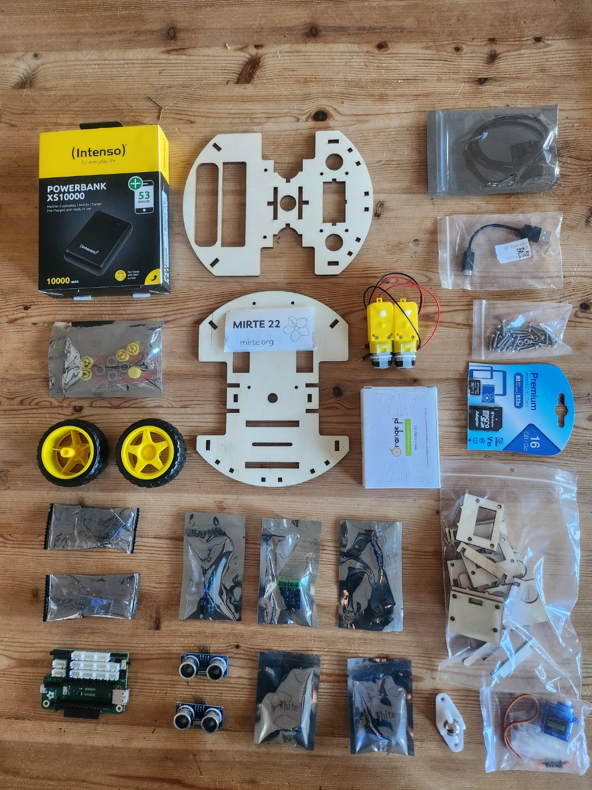
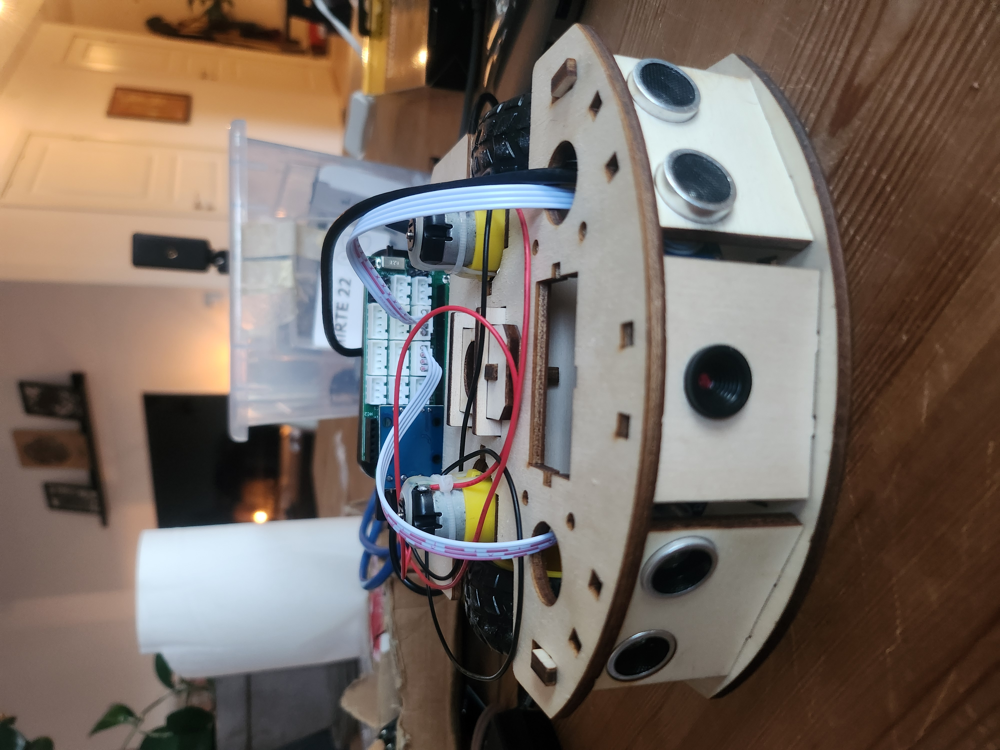
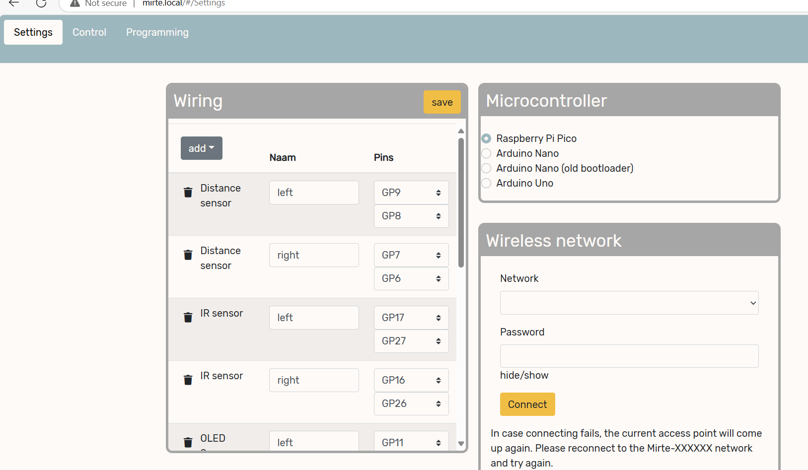

_I've spent some days building the low-cost open source educational robot developed by TU Delft! Here a short blogpost describing that experience and some ideas and plans of projects I could possibly do with it. It's an awesome platform_

<!-- more -->

So when I decided with a little career break before starting anything new, I had a whole list of things and projects that I'd like to do, but I haven't been super successful with that.
The first month of that was... intersting in the sense that I've started all kinds of art projects, just to figure out I'm bad at origami.
At least I've managed to exercise a lot, eat well, and finish off Spiderman 2 on the Playstation 5 (I highly recommend this game).
But after FOSDEM I've gotten the urge to create something again, and perhaps the inspiration of being there helped with that.
I digitally 'recreated' my personal website (see the blogpost right here), but I'm a robotics engineer... at one point I'd like to make something physical, with sensors that move. 

I'm very glad that on a previous trip to my old university town, Martin Klomp borrowed me building materials to build the Mirte, an fully open source robot that the TU Delft has developed for educational purposed. 
I knew Martin from my time at the organizing committee of the Robocup Junior (NL) competition in the Netherlands, so this is a project that has come from all that shared experience of needing a good standard mobile robot for kids and students alike.
THis platform is and will be used in their university clases in robotics as well, so I'm excited to try it out.

<center>{ width="300" }</center>

So I got the building materials for the Mirte pioneer (see the picture here above), but there are other versions as well, that have less capabilities but more suitable for kids or students who are just getting started.
I've made a picture of everything that came in the box, which are all off the shelf.
The version I had did had the 'Mirte PCB'm of which the KiCad files are availabe under the CERN open hardware licence, but the Mirte website also provide instructions to connect all the sensors through wires and a breadboard. Also I've gotten a whole bunch of sensors like sonar, camera, infraredsensors and some screens. How will it all fit!

<center>{ width="300" }</center>


So once I've covered all the materials, I followed the building instructions on the mirte website.
It had visual instructions that made it quite easy to put thing together. But I was more impressed with the clever design of the base itself.
The Orange board and the mirte pcb were attched with screws along with some sensors, but the base itself could be assembled without the use of even one screw.
Even the motors for the wheels could be easily clicked into place.
Also, in the front part of the base, there were modules for the sensors such that could be clicked in facing forward, and changed to other sensors depended on the application of the project.
This is a very handy feature.

<center>{ width="300" }</center>


Here a video of the full build

<center><iframe width="560" height="315" src="https://www.youtube.com/embed/JcqcggjcqF8?si=GLnWwj4mbfMycYdx" title="YouTube video player" frameborder="0" allow="accelerometer; autoplay; clipboard-write; encrypted-media; gyroscope; picture-in-picture; web-share" referrerpolicy="strict-origin-when-cross-origin" allowfullscreen></iframe></center>


So once I've put in the flashed SDcard, I was able to connect with Mirte since it initializes like a WiFi access point. The web UI is where I could put in the SSID and password of the accesspoint that I'd like the MIRTE to connect to instead. Since I am currently running in Windows (yeah yeah I know the torture I put myself through), I'll skip it for now because I know what kind of network issues I'll be getting with that, and I want to get driving right away! 

<center>{ width="300" }</center>


So here in this web UI I can also test the sensors. I've put on 2 distance sensors on the sides and one camera. The camera isn't shown on the GUI yet, but I can already test out the right and left distance cameras. Also it contains a simple control panel so that I can remote control the MIRTE and chase my cats!


I was about to quit here and leave the MIRTE on a shelf while I think about a next project... but then late at night I woke up in cold sweat where my unconsious robotist of mine said: NO WAY! There is no way that leave it just at a remote controlled car... let's at least connect those sensors to something! Since there are 2 distance sensors on the side, this is the perfect oppertunity to make a Braitenburg robot, which is litterly 2 lines of logic (or 2 blocks for blockely). 
Mirte has API for blockly, Python and ROS1, but I'll stick it with Python for now and wait for the ROS 2 version to come out (this will be somewhere in 2025).
But it was possible to edit this all in MIRTE's webgui.

```python
max_speed = 50 # percentage speed
while True:
  left_dist = mirte.getDistance('left')
  right_dist = mirte.getDistance('right')
  right_motor_speed = round(min(max(left_dist, 1), max_speed))
  left_motor_speed = round(min(max(right_dist, 1), max_speed))
  mirte.setMotorSpeed('right', right_motor_speed)
  mirte.setMotorSpeed('left', left_motor_speed)
```

And that is what a braitenburg robot is, where the sensors are directly connected to the actuators. 
This is as simple of a robot that can be.
But with this it can already avoid most of the obstacles (and cats) in the room!
The distance sensors don't have a very large field of view so there is a dead spot right in front of it (like the chair leg).
But as long going with a slow speed... there is usually no harm to MIRTE.
That is how easy robotics can be.

See here the full video of testing the distances sensors and wheels, and making the Mirte drive autonomously based as a Braitenberg vehicle.

<iframe width="560" height="315" src="https://www.youtube.com/embed/CBb7-vnnBmc?si=iLKSgSTNvPmbG5Hd" title="YouTube video player" frameborder="0" allow="accelerometer; autoplay; clipboard-write; encrypted-media; gyroscope; picture-in-picture; web-share" referrerpolicy="strict-origin-when-cross-origin" allowfullscreen></iframe>

## Conclusion and what is next?

So I'll leave the MIRTE alone after that (tiny) crash, since I need to figure out how to access the camera and think about what other sensors I can add.
For instance, I do have a AOK-D lite camera and a small lidar I can put on top.
And how about a small arm or gripper?
So many possiblities, but I'll wait until my unconsious robotist wakes me up in the middle of the night with a good plan.
But all in all, the MIRTE is a really nice platform, and the base is quite sturdy as well. 
And the webUI to control it and define the sensors is very well thought out as well.
The project is still in development and I'll make sure to share my notes for improvement with the developers (or contribute).
But I can't wait for the ROS 2 packages to come out for this robot so that I can connect it with NAV 2, Gazebo harmonic, or have a Crazyflie land on it with Crazyswarm2.


If you want to check it out, all of the build plans are open sourced and can be found on Mirte.org. 
The full base can be lasercut out of 4 mm MBF and configured to accomendate other sensors as well. 
I kind of really want to buy a lasercutter for myself now infact... anyone know of a good model for home/hobby use by any chance?
But in anyway, thanks again to Martin Klomp from [RoboHouse](https://robohouse.nl/) at TU Delft to lending me the MIRTE. It was fun!
