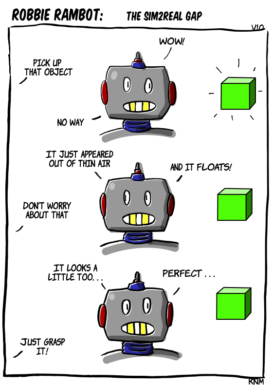

[{width=100}](robbie_sim2real.md)

*This is on me... I didn't prepare Robbie enough that we will be testing in simulation today, so usually have to clear out some  suspicion first. Gotta look at a simulator with higher fidelity and better physics.* 

*Enjoy!*

<!-- more -->

![A three-panel comic strip titled "ROBBIE RAMBOT: THE SIM2REAL GAP". The comic depicts a gray robot with red circular details on its head and a blue corrugated neck interacting with a bright green cube. Panel 1: The robot is instructed by an off-screen voice to "PICK UP THAT OBJECT," pointing towards a green perfect cube that has just appeared. The robot exclaims, "WOW! Panel 2: The robot responds with "NO WAY", IT JUST APPEARED OUT OF THIN AIR... AND IT FLOATS!"and then the offscreen voice says "DON'T WORRY ABOUT THAT." Panel 3: The robot looks hesitant, saying, "IT LOOKS A LITTLE TOO... PERFECT..." The off-screen voice insists, "JUST GRASP IT!" ](images/robbie_sim2real_lowres.png)

Give comments here below for feedback :robot:
