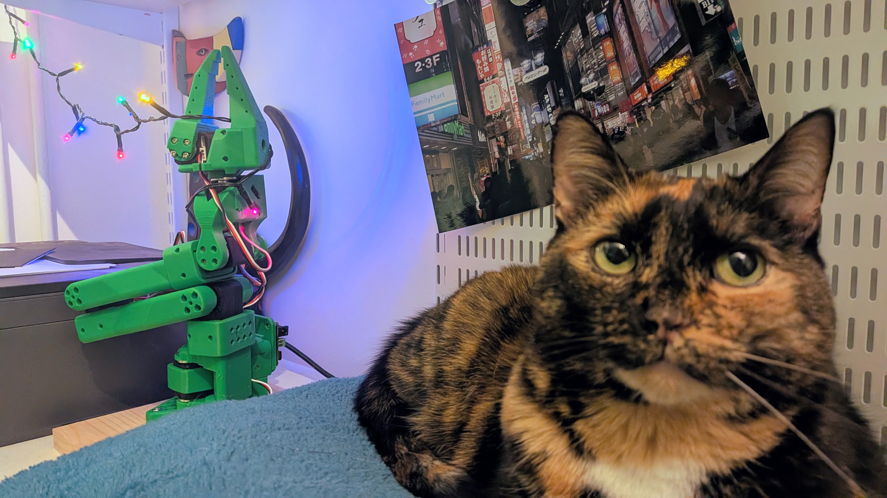
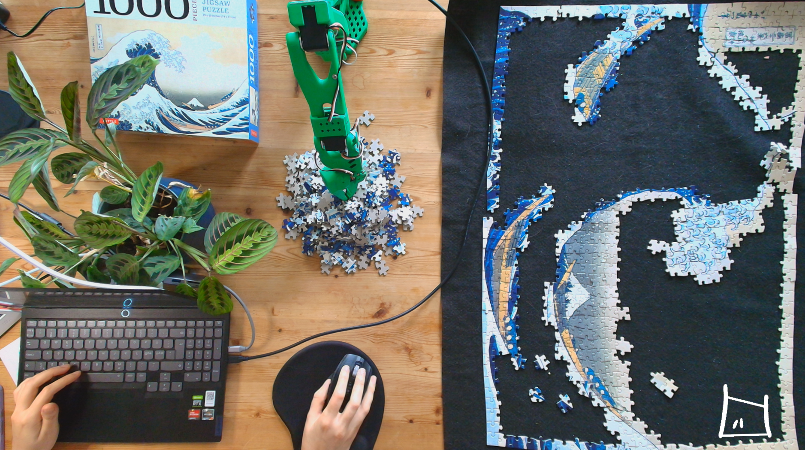

[{width=100}](robot_arm_part1.md)

_It is always good to be reminded of how hard robotics can be! I got a taste of that again when I worked with the SO-100 this summer and the last few months. But I had a lot of fun building it at least!_

<!-- more -->

This summer I tried something new! I've done a lot of simulation, swarm robotics and aerial vehicles in my career, with mostly vision in the mix. I just have never worked with robot arms, aka manipulators before! Time to change that, and this summer after receiving my shiny new 3D printer I thought, let's try out that fancy SO-100 arm that everyone is raving about! I'm sure it is fully integrated into ROS 2 so I could get started right away.
## Building the arm!

The [build of the SO-100](https://github.com/TheRobotStudio/SO-ARM100) was surprisingly easy! Sure, I had to wait a few weeks to get the Feetech motors in, and my Bambu A1 mini had to do all-nighters for a while, but once I had those in I was all ready to go! I only was a bit late to notice that I wasn't printing out the new fancy SO-101 version, but luckily it used exactly the same motors. The other things like the adapter, USB cables and wood clamps were all locally available at the local hobby stores here.

It took me a couple of afternoons to assemble the SO-100 arm, and it was a lot of fun doing so. There were a couple of pieces of the arm that definitely were a very tight fit. Luckily that was something that I could fix with a very professional heat gun (aka my hairdryer). It was only unfortunate that I found out at the very end that I had accidentally mixed up the carefully ID-programmed motors in order.

Luckily I was able to still access those motors and was able to change the IDs programmatically, so no harm done and I was able to calibrate the motors at the end as well.

I've made a compilation video of the streams of the build. This was all built in a LoFi-build video I've been experimenting with, so it might be nice to play in the background after a day of work!

<iframe width="560" height="315" src="https://www.youtube.com/embed/To5IaJ_1NLs?si=QeYRp5nnuAs2UMEt" title="YouTube video player" frameborder="0" allow="accelerometer; autoplay; clipboard-write; encrypted-media; gyroscope; picture-in-picture; web-share" referrerpolicy="strict-origin-when-cross-origin" allowfullscreen></iframe>

And for those that don't have the patience, there is a sped up version of the same build process:

<iframe width="560" height="315" src="https://www.youtube.com/embed/8lhbWUhtOF0?si=_gr7t8pJwMcs667d" title="YouTube video player" frameborder="0" allow="accelerometer; autoplay; clipboard-write; encrypted-media; gyroscope; picture-in-picture; web-share" referrerpolicy="strict-origin-when-cross-origin" allowfullscreen></iframe>

## Controlling the arm

Once I finished building the arm, I had a couple of conferences to go to, and afterwards I wanted to get straight into it. I decided to skip the official SO-100 control instructions (as I didn't order enough motors) and went straight into ROS! I didn't additionally build the teleoperation arm, but since I saw that there was a [SO-100 ROS package](https://index.ros.org/r/so_arm_100_hardware/#jazzy) by Bruk Gebregziabher. 

The previous ROS package was built so that it could serve this [SO-100 arm project](https://github.com/brukg/SO-100-arm). It proved to be a little harder than I thought, but after I figured out the calibration, I was able to make the robot arm move from one place to another. The project was considered still experimental, so the MoveIt integration is not fully finished. So no... it was not able to pick up the puzzle pieces autonomously... yet!

## To Be Autonomous

This was with very little autonomy though, and little did I know that puzzle pieces are really tough! I remember the [ROSCon UK 2025 Keynote by Steve Cousins](https://vimeo.com/showcase/11908222) where he said that he won't be impressed until a humanoid can complete a LEGO set autonomously. I'd like to add puzzle solving as well to that! And no... not with a specialized built robot for that like [Mark](https://www.youtube.com/watch?v=Sqr-PdVYhY4). It needs to have an arm and be able to gently guide kitties away!

But still, the SO-100 and its successor the SO-101 arm are great arms for personal projects in embodied AI and will be a gateway project for many to start out in robotics. I myself will need to take a break to focus on some other projects, but once I have time I'd love to have a go at making the arm even better, and perhaps trying out the [demos by the new Physical AI group at ROS](https://github.com/ros-physical-ai/demos). So more fun next time :)

For now, it will do well holding my Christmas lights in the office space. Happy holidays everyone and talk to you next year!

