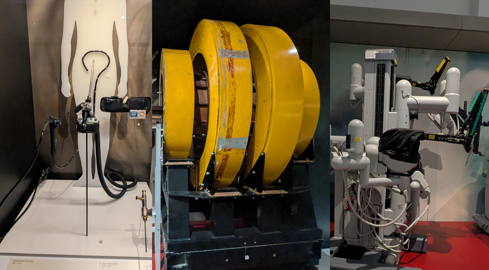

[{width=100}](roboticist_to_the_doctor.md)

_This is probably the fastest I've ever written a blogpost. First the news of Catherine O'Hara dying from complications of rectal cancer, and then just a few moments ago... James Van Der Beek didn't survive his stage 3 colorectal cancer diagnosis from 2023, the same year I got diagnosed with stage 3 rectal cancer. However, in this blogpost I'd like to highlight how glad I was for some of the moments I got because of that diagnosis, and a lot of it also had to do with my background as a roboticist._

<!-- more -->

___

Going through those first couple of months of my cancer diagnosis was one of the worst periods of my life. But also one that I so vividly remember, that I also remember the glimmers of awe that felt a little more special due to what I was going through. Everyone finds their own way to cope, and for me, it was the medical technology I came into contact with and the parallels I saw with my own field of robotics engineering, or sometimes just cool technology in general. These were anchors that got me through from one phase to the next, so I wanted to tell a couple of stories from that period that highlighted the extra joy of being a roboticist.

## Geeking out over Da Vinci

Throughout the entire treatment, there was one thing that loomed over me... surgery. And of course I didn't want to get it as it was considered a risky one. I'll spare you the details, but basically with rectal cancer, the "plumbing" doesn't quite fit, and anyone doing self-home maintenance knows what I'm talking about.

But there was one thing that got me past the fear of this entirely. The fact that I'd be getting surgery with the assistance of the famous Da Vinci surgical robot!

When I heard that I had responded so well that we could do non-operative management (wait-and-watch), I was actually... slightly disappointed. (But of course only for a little while!)

{width=500 .center}
*
A colonoscope, a prototype MRI and an older version of the Da Vince surgical robot. Taken by me  at the Science Museum in London
*

A little over 1.5 years later, I visited the Science Museum in London together with a good friend. There was a medical technology department, and of course, there it was: an older version of the Da Vinci robot. I went over to it straight away and completely geeked out. Right next to me, there was a man about my age doing the same. He told me he actually got surgery with it, namely a liver resection. I should have asked for an autograph right there, but then I realized what that type of surgery meant, so I asked him what the cause was.

Liver metastasis due to stage 4 colon cancer.

Still, there we were, geeking out about the technology that prolonged his life, like we were in the front row of a concert of our favorite band.

## Medical SLAM

As part of the treatment, I had to go through a short course of radiation before I started my chemotherapy. When I first went in for mapping in... another donut... I expected that I would get marker tattoos like you usually do, so that the radiologist can align you as precisely as they can, except... I didn't get any. When I went for my first dose of radiation, which was in a slightly thicker donut (somewhere between a CT scan and an MRI), I kept wondering for the next few days how they could align me so well without tattoos! There were sure a lot of cameras in the ceiling though... weird.

It was only on day 3 that I noticed the radiologist and assistant weren't looking at me while aligning... they were looking at a screen behind me. I was not supposed to move during this time, but I took a peek anyway, and what I saw was mind-blowing.

They were SLAMming me!

For those not in robotics: SLAM stands for Simultaneous Localization and Mapping, and it's one of the core techniques we use to help a robot figure out where it is in the world by building a map of its surroundings in real-time. And here it was, being used on me. I saw them aligning a 3D model of my pelvis with my current 3D representation, and it was green on the parts that were aligned and red on the parts that weren't. THAT was what those cameras were for, to build a 3D representation of me (or at least a part of it) and match it to the model.

Now that was cool. I should ask them for the 3D model so that I can 3D print it.

## The Donut of Truth

One of the first scans I needed to do was an MRI. I had never done an MRI before and I was scared shitless. I never thought myself to be claustrophobic, but what if I was? And what if I was allergic to the contrast or whatever they'd inject into me? And of course... what would the result be. I did not sleep well the night before, that's for sure.

On the scanning day itself, I got a headset to supposedly block out the sound. I figured I could perhaps count how many songs there were. I had a 30 minute scan, so it would last about 8 songs I reckon on the classic rock channel? I only didn't realize that I would have difficulty hearing those, because an MRI makes... a lot of sound. And it's not all the same sound either, it was constantly a different "tune", like a rave party with a good DJ.

These are all different modes, caused by the switching of coils which change the magnetic field to excite different atoms in my body. I was quite glad that a friend sent me [this video](https://youtu.be/NlYXqRG7lus?si=ETeQl8Wv1YwDePNF) just before I went in, to help against my fear that I might have claustrophobia (spoiler... I apparently don't). Perhaps not entirely related to robotics, but still quite amazing technology.

> All will be revealed in the Donut of Truth - Dr. Robby in the HBO series The Pitt.

## What carried me

I will soon hit my 2 year scan mark, which is a very important milestone in my recovery. And looking back at the journey so far, these stories are perhaps more about identity than they are about the technology. It is about the fact that you can be amazed by what is currently possible, and the stories that stick around because of it. These are parts of us as human beings that propel us forward. It is not about the end goal, but about the moments that you can enjoy right now.

I am a roboticist, and have been for many years. That fact has helped me get through some of the hardest periods of my life, along with the great community that comes with it. But it's not the only part. I've rediscovered my creative side as well, which also propelled me through some of those periods and still does to this day. And I'm sure that other parts of me, like having gone through cancer, will help me in the future too.