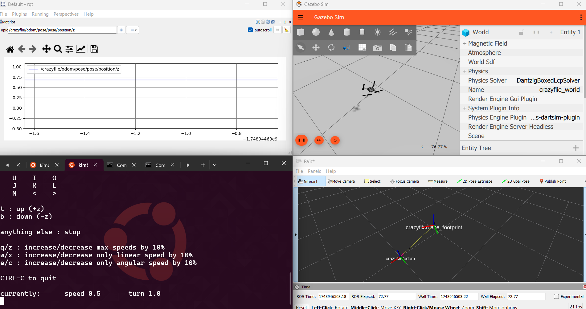
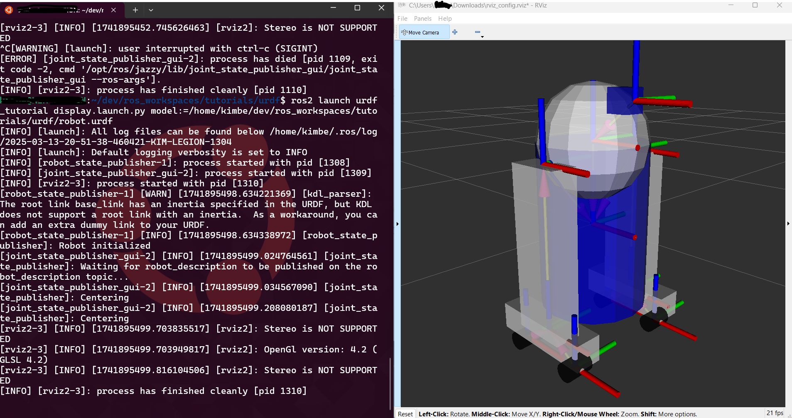
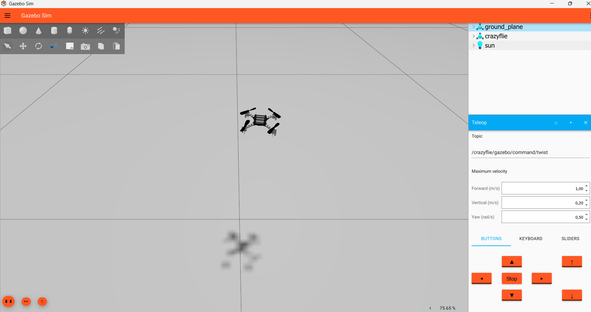
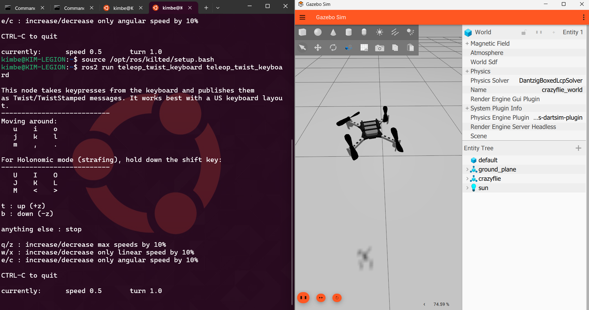
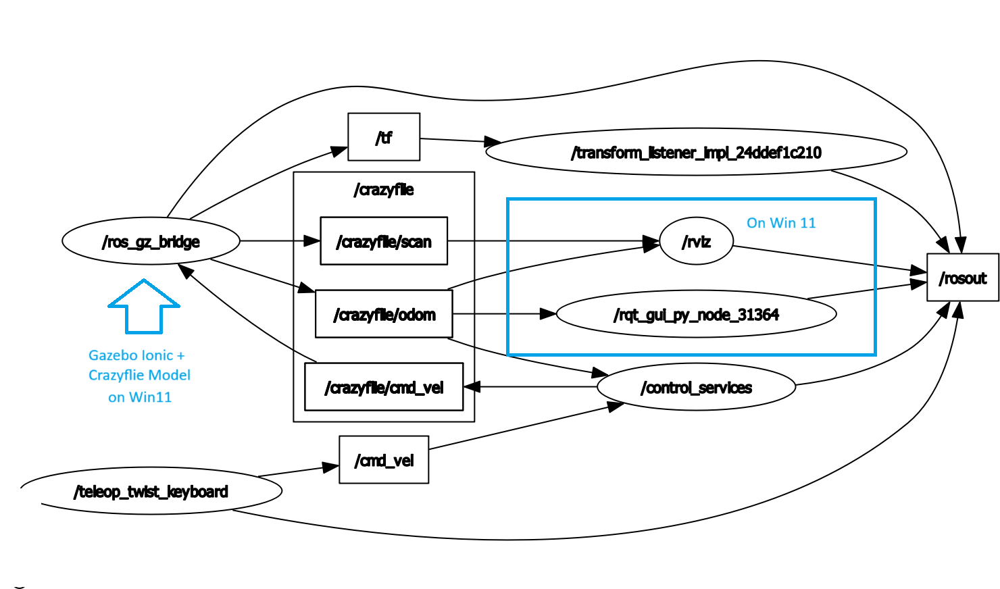

<script data-goatcounter="https://knmcguire.goatcounter.com/count"
async src="//gc.zgo.at/count.js"></script>

[{width=100}](ros2_across_the_windowverse.md)


_Three months ago, I went head-first into full-on Windows Development. Have I gone screaming mad already? Well... no, actually! I managed to establish a handy workflow between the ROS native Windows install and WSL2. This blog post shows the process of what I've set up._

_Enjoy!_

<!-- more -->
___

About 3 months ago, I made the 'drastic decision' to go full Windows. I only have half a terabyte on my laptop, which isn't great for gaming (or ROS/simulation), and I just didn't want to switch OSes on my dual-boot. I would need to decide what I wanted to do each day, like core C++ or ROS development, or graphics CAD design, to avoid disturbing my workflow with constant switching. Since the situation of WSL2 on Windows has drastically improved, I decided that would be the fallback in case I couldn't get things to run on Windows natively.

In [this last blog post in March](https://www.mcguirerobotics.com/blog/2025/03/14/robotics-on-windows-are-you-mad/), I found that the new install instructions for ROS 2, which used the [Pixi package manager by Previx.dev](https://pixi.sh/latest/), already made things soooo much simpler than before (I literally use Pixi for everything right now). Back then, I could only install ROS 2 Jazzy from source, but it ran on the command prompt and I was able to make it communicate with the WSL2 Ubuntu 24.04 Jazzy with a simple talker and listener. And when I was able to launch a URDF model from WSL2 and actually display it on RVIZ2 on native Windows, I remember myself being almost like a proud parent  :smile:

<center></center>

Now that Kilted Kaiju came out about a week ago, I wanted to see how far I could push this further. I love WSL2, and it helps me out on a daily basis, but the GUI handling is just very janky, and I have no control over what in WSL2 I want my second Nvidia graphics card to care about. So my goal is: (1) Gazebo Ionic to run natively on Windows 11, (2) run the ROS 2 (Kilted Kaiju) - Gz Ionic bridge and other ROS 2 on WSL2, and (3) debug using RVIZ2 and RQT back on native Windows again. Why? Because it's a challenge!

> I've written this blog post in a tutorial-like style, so you can try to follow along. Having said that, it's all super experimental and you WILL encounter bugs. Be prepared to do some code digging and fixing yourself :wink:

## Gazebo Ionic on Windows 11

Since I didn't want to do any core development on Gazebo itself, I went through [the binary installation instructions](https://gazebosim.org/docs/latest/install_windows/) for Gazebo Ionic. Here, they recommend using the Conda package management system, which I tried during the Gazebo Ionic testing tutorial party, and that works fine. But this time, I wanted to use Pixi\! Instead of installing the `libgz-packages` one by one, I could add them to the `pixi.toml` file as dependencies with the correct numbering and version. I've added the [pixi.toml file as a Gist here](https://gist.github.com/knmcguire/c5b14909cf76cc80593c98ddebef51c6).

The cool thing about Pixi is that you can also make use of [multiple environments](https://pixi.sh/latest/tutorials/multi_environment/). So I've added the dependencies of both Gazebo Ionic and Gazebo Harmonic (which is the latest **Long-Term Release**). And then switching between Gazebo versions is as easy as:

```console
# Harmonic
pixi run -e harmonic gz sim
# Ionic
pixi run -e ionic gz sim
```

Mind that for Windows there is still a bug that requires me to start the server (`gz sim -s`) and GUI separately (`gz sim -g`), but luckily it is all in just one line now to activate both the Conda/Pixi environment and run Gazebo, so it's not that much of a hassle. I have heard through the grapevine that soon (at least for the upcoming Gazebo Jetty), this dual startup procedure will no longer be required. And the nice thing to make it even simpler, you can put Gazebo Ionic as the default environment, so no `-e ionic` is even a requirement if you know which simulator version to use.

So I looked at an older simulation model of the [Crazyflie](https://github.com/bitcraze/crazyflie-simulation) made for Gazebo Harmonic and tried to get it to fly (in the command prompt):

```cmd
git clone https://github.com/bitcraze/crazyflie-simulation
set GZ_SIM_RESOURCE_PATH="/FULL/PATH/TO/crazyflie-simulation/simulator_files/gazebo/"
pixi run gz sim -s worlds crazyflie-simulation/simulator_files/gazebo/worlds/crazyflie_world.sdf
```

If you add the Teleop widget (3 dots from top right) and add `/crazyflie/gazebo/twist/command`, you can control its speed in both vertical and linear direction with the [multicopter velocity control plugin](https://gazebosim.org/api/sim/8/classgz_1_1sim_1_1systems_1_1MulticopterVelocityControl.html). I also needed to add Pixi's `ruby.exe` (which runs Gazebo) to the Windows graphic driver handler (System \> Display \> Graphics - Custom settings for applications on Win11).


<center></center>

Unfortunately, the controller of the simulated nano quadcopter is not tuned to perfection, so whenever I go forward or rotate, the drone drops in height. I'd like to fix that (for now) with an external ROS 2 controller with the ROS 2 Gazebo bridge.

## ROS 2 Kilted Kaiju on WSL2

Since the ROS 2 distribution for Windows doesn't come with the ROS Gazebo bridge by standard yet, I decided to work on that on WSL2. I first thought that I'd need to find a way to build the `ros-gz-bridge` on Windows natively, which seems to require a source install of Gazebo Ionic, but I don't want to get into that now. So I've installed [ROS 2 Kilted Kaiju](https://docs.ros.org/en/kilted/Installation/Ubuntu-Install-Debs.html) with the full desktop version so it comes with Gazebo Ionic already. Technically, you could do a barebones install and only add the Gazebo ROS packages, but as you already noticed, I'm a bit lazy today :stuck_out_tongue_winking_eye:

Luckily, I found out that Gazebo topics can be read out by a Gazebo Ionic installation on WSL2! With the quadcopter simulator still running on Windows and in the air, I could just write:

```
gz topic -t "/crazyflie/gazebo/command/twist" -m gz.msgs.Twist -p "linear: {x:0 y: 0 z: 0.0} angular {z: 0.5}"
```

As before, the quadcopter drops down, so time to add that ROS2 Gazebo bridge and simple control node! So in WSL2 with a full-desktop install:

```bash
cd ros_ws #or how you call your ROS build space
mkdir src
cd src
git clone https://github.com/knmcguire/ros_gz_crazyflie src/ros_gz_crazyflie
source /opt/ros/kilted/setup.bash
colcon build --symlink-install
source install/setup.bash
ros2 launch ros_gz_crazyflie_bringup crazyflie_simulation.launch.py gazebo_launch:=False
```

and then in another bash terminal in WSL2 run:

```bash
source /opt/ros/kilted/setup.bash
ros2 run teleop_twist_keyboard teleop_twist_keyboard
```

Now there is a separate ROS 2 node with a simple take-off service that reacts to 't' input in the ROS2 teleop node if still on the ground. Also, it is possible to move it around using the `I/J/L/M` keys on the keyboard. It's set to do a non-holonomic movement of the drone, such as a ground vehicle, but you can change the control node to your liking as it is mostly experimental.

<center></center>


So now we have ROS2 on WSL2, controlling the drone Gazebo simulation on Windows native, which is really cool already! But now I want to check the topic, node graph, and the Transforms in RVIZ2, which I don't want to do in WSL2 (janky GUIs), as there are plenty of things I'd like to update with that. Let's go to the ROS2 installation natively on Windows 11!

## ROS 2 Kilted Kaiju back on Windows 11

So now that it is possible to install the ROS 2 Kilted Kaiju binaries in Windows 11 via [these instructions](https://docs.ros.org/en/kilted/Installation/Windows-Install-Binary.html). Currently, it needs to be fixed to a directory in `C:/pixi_ws/` but hopefully, we will be able to fix that soon with this [ROS2 GitHub ticket](https://github.com/ros2/ros2/issues/1675).

> Note: Mind that if this was an experiment with ROS 2 Jazzy and Gazebo Harmonic, that the packages from the [Robostack project](https://robostack.github.io/) would have been sufficient already!

Once installed, to the installed ROS2 directory, open up a Pixi shell and source the ROS 2 Kilted Kaiju distribution:

```bat
cd C:/pixi_ws
pixi shell
call ros2-window/setup.bat
rqt
```

Open up the plotter (rqt > visualisation > plot, might need to install a plot library which you can add with `pixi add`), and you can look at the height topic for instance `/crazyflie/odom/pose/pose/position/z`. Go back to the teleop node on WSL2 (or you start one on Windows native), and see what happens if you control the height with keys `t` and `b`.

In another terminal open up Rviz2 and open up a transform:

```
call ros2-window/setup.bat
rqt
```

Since all the GUIs are in Windows natively, you have more control about their resizing, including the nice 2 x 2 format for a nice overview. Here you see a screenshot where I have the quadcopter in Gazebo (Windows native), Teleop and control (WSL2) and both rqt plotter and rviz2 (Windows native) open on the same page.

<center></center>


## Final Conclusion


So if you look at the full rosgraph it looks pretty awesome. And it is quite handy that I can control the gui windows more easily. This will be a improvement to my workflow of developming on ROS2 on windows.

<center></center>

Having said that, there are still things that can be improved:

- Having ROS 2 running on both natively and WSL2 takes up some resources and is not efficient
- I still have to manually start gazebo from Windows, as that can't be done from a launch file from WSL2
- Gazebo still has some bugs for the Windows, but that is to be expected as the maintaince team notes it at 'experimental' (I'll make sure to make GH issues of all of these.)

Nevertheless! I'm still quite excited for other possitilities that can come with this! Let's see if I can also get this to work with other simulators as well like [Nvidia Isaac Sim](https://developer.nvidia.com/isaac/sim) or [O3DE engine](https://o3de.org/). Many thanks to the ROS 2 and Gazebo Devs for making this happen, and again, kudos for the Pixi project! It makes my (development) life so much easier now!

Here is a video compilation of the full run through of my WSL2-Win11 Kilted-Ionic tryout. I will also present a run through at my [Indie Robot Twitch stream of tomorrow](https://www.twitch.tv/indierobot/schedule?seriesID=b4d96240-af58-44ea-9262-76d739c8351b) (Wednesday 4th of June 2 pm UTC). I've started streaming here as of recent, where I try out all kinds of robotic and simulator tools every week on Wednesdays, so hopefully see you tomorrow!

<center><iframe width="560" height="315" src="https://www.youtube.com/embed/zl1XKQZi6I4?si=Xm90aRCURD1u1Fbn" title="YouTube video player" frameborder="0" allow="accelerometer; autoplay; clipboard-write; encrypted-media; gyroscope; picture-in-picture; web-share" referrerpolicy="strict-origin-when-cross-origin" allowfullscreen></iframe></center>