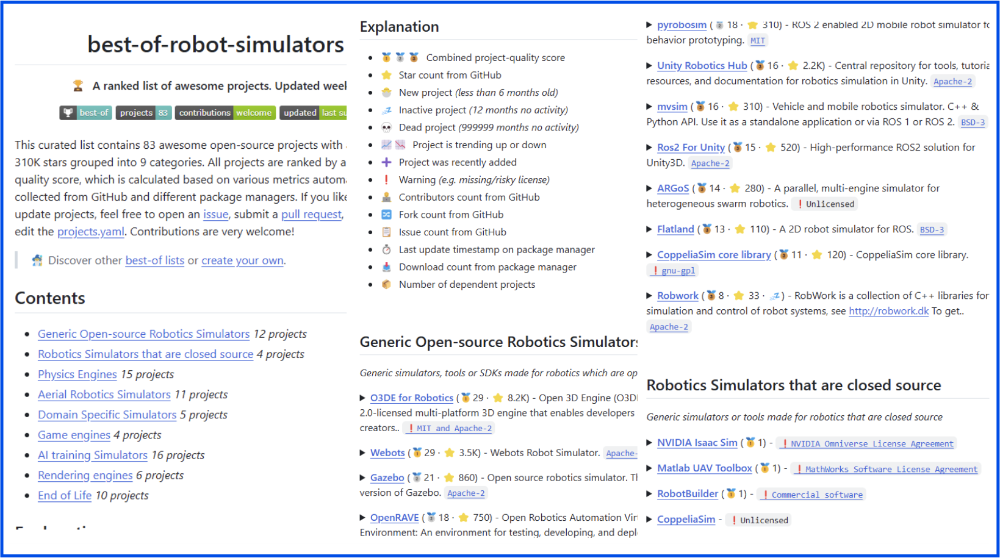

[{width=100}](simulation_landscape.md)

_In this blog post, I explain how I tried to figure out in which simulator I should invest some of my project development time. Little did I know of the very deep rabbit hole that presented itself, and I dived right in! Did it help me with my choice? A little, but perhaps I've created something that is even more useful: a best-of-list of robot simulators._

_Enjoy!_

___

It's been less than a week since I announced I'll go freelancing as a robotics engineer. This means freedom, independence, no one telling me what to do! ... yes, that might be a problem... because if no one tells me what to do, how do I know what is important to know and to learn? One part is, of course, what I'm interested in, one part is what the client needs, and most importantly, which tools are already available out there. That is something that I'll just need to determine myself through research.

So why focus on simulation? I've already worked on robotic simulation for the Crazyflie back at Bitcraze ([blogpost 1](https://www.bitcraze.io/2021/12/simulation-possibilities/), [blogpost 2](https://www.bitcraze.io/2022/03/updates-on-simulation-work/)) where I worked mostly with [Cyberbotics' Webots](https://cyberbotics.com/) and [Open Robotics' Gazebo](https://gazebosim.org/home), which are both awesome and big staples in robotics. However, they have some limitations in rendering capabilities and physics for fluid and air dynamics. Of course, this can be solved by making a plugin for better rendering and physics engines, but which options are available for those?

## What is a robotic simulator?

That is what my husband asked me, and you know what, it is surprisingly difficult to explain. He comes from physics and material science, and their definition of the word 'simulation' is very different from how we view simulation. The meaning or implementation is very different depending on which field you are from. Basically, [the Wikipedia page definition of a simulator](https://en.wikipedia.org/wiki/Simulation) is:

> A simulation is an imitative representation of a process or system that could exist in the real world.

This is an extremely broad term and can stand for anything, from a pseudo-random dice roll program to a finite element analysis of a steel beam, to a high-fidelity rendering of camera footage of a virtual drone. This is just to illustrate how big the term actually is!

And how about a simulator for robotic systems? For that, I actually had a little bit of help from Gemini for this:

> A robotic simulator is a software framework that provides a virtual environment, often leveraging different physics/rendering engines and sensor models, to model the robot's behavior, its interaction and perception with the simulated world for design, evaluative or data-generative purposes.

That seems more like the definition that I'm most familiar with in robotic simulation. There are some key words in there that will probably be important:

- **virtual environment** - To provide the scenario for the simulated robot to act in, depending on the application, like an indoor building, forest, or lunar landscape.
- **behavior, its interaction and perception** - The simulated entity should be able to interact with and act upon that virtual environment or world through its simulated sensors and actuators.
- **physics/rendering engines and sensor models** - To be able to simulate those interactions and perceptions caused by the robot's behavior, to model how an object will slip while being grasped or the noise of the lidar ranges.
- **design, evaluative or data-generative** - To use this as a development tool, as part of continuous integration to assure quality, or to collect data that can be used for AI training purposes.

For a more in-depth explanation of the definition of robotic simulation and its purposes, I would very much recommend you read the [Ekumen blog post on robotic simulators](https://ekumenlabs.com/blog/posts/accelerate-robotic-dev-sim/) and [watch their presentation at FOSDEM 2025](https://fosdem.org/2025/schedule/event/fosdem-2025-6252-accelerating-robotics-development-through-simulation/). This also helped me get some clarity in the definitions, and I've learned a lot from it as well.

## Starting with simulators for aerial robotics

At ICRA 2023, when I was still part of Bitcraze, I helped organize the Workshop [the Role of Robotic Simulators](https://imrclab.github.io/workshop-uav-sims-icra2023/) with co-organizers Giuseppe Silano (CVUT), Chiara Gabelleri (TU Twente), and Wolfgang Hönig (TU Berlin). The original purpose of the workshop was to settle on one simulator for all aerial robotic applications. What we got were 16 papers on all different aerial robotics simulators built or assembled for different purposes. Instead, we chose to write a survey paper instead, which got published last year in Robotics and Automation Magazine.

> C. A. Dimmig et al., "Survey of Simulators for Aerial Robots: An Overview and In-Depth Systematic Comparisons," in IEEE Robotics & Automation Magazine, doi: 10.1109/MRA.2024.3433171 [:fontawesome-solid-file-lines:](https://arxiv.org/abs/2311.02296)

By the way, Giuseppe presented this work at one of our Aerial ROS meetings in September last year, so check out [the recording here](https://arxiv.org/abs/2311.02296). Moreover, if you happen to be at [ICRA 2025 in Atlanta](https://2025.ieee-icra.org/), one of the co-authors, Joseph Moore (Johns Hopkins University), will present the paper at the Aerial Robots 1 session on Tuesday, May 20th at 10:20 local time.

In this survey paper, we collected over 50 simulators for Aerial Robotics alone, of which a subselection of about 10 were more properly evaluated. With that subselection, I started my investigation to see which projects or underlying simulations I should try to learn more about, which helped me a lot as a starting point.

But as I went through, I saw that many of these projects are not regularly maintained. Just an example: [Airsim](https://github.com/microsoft/AirSim) (built on Unreal Engine) is planned to be archived, and there will be no [continuing with the promised project Airsim](https://www.businessinsider.com/microsoft-shutters-project-airsim-ai-strategy-openai-2023-10). Also, some of these simulators use the Unity game engine as well, but then I found out that the [Unity Robotics hub GitHub](https://github.com/Unity-Technologies/Unity-Robotics-Hub/tree/main) seems very barren at this moment (it seems like the robotics team got [laid off last year with the last mass firing](https://techcrunch.com/2024/01/09/unity-to-lay-off-another-1800-employees-representing-25-of-its-workforce/#:~:text=Just%20a%20few%20weeks%20after%20its%20most%20recent,improve%20its%20financial%20performance%20after%20a%20difficult%20year.)).

So... that doesn't really help me, does it? I do want to go into a framework that is healthy, well-maintained, and has a development future in robotics. But I don't want to constantly do the same investigation again and again, as it is very time-consuming and emotionally draining (and with emotionally I mean that every time I set my heart on one framework, I find out the full project has been dropped).

## Generating a Best-of-Robot-simulators list

It all started when I updated [my website last February](first_blogpost.md/#how-did-i-make-the-website-and-blog) and for [my freelancing adventure](going_solo.md/#my-new-portfolio). I'm using [mkdocs](https://www.mkdocs.org/) for generating my website (and I think I've already expressed my love for it plenty of times), but I was amazed by their [plugin catalog](https://github.com/mkdocs/catalog). Anyone can make their own plugin for the framework and get listed here in this best-of-list. And the cool thing is that it grabs the meta data from the GitHub repository in terms of stars, downloads, forks, and activity, and makes a ranking of how well these projects are doing, fully automatically. So you can see immediately which are the most relevant and healthy projects to go for.

Fully inspired, I decided to make my own best-of list... of Robotic Simulators! And here is where the rabbit hole presented itself, since I dove in headfirst, not knowing how deep it was. But I'm just too curious, and I'm a bit of a completionist. Of course, I have my limits with this, or else I would still be playing Red Dead Redemption 2 full time to this day. But at least I wanted to research this to a point that I will be able to make my decision and that it might be useful for others as well.

So there you go, a [Best-of-list for robot simulators](https://github.com/knmcguire/best-of-robot-simulators)

This consists of more than 80 projects, which can be combinations of each other and are both open and closed source (although the latter won't be correctly ranked obviously). Currently, I've selected 9 categories:

* **Generic Open-Source Robotic Simulators**: Generic simulators, tools, or SDKs made for robotics which are open-source.
* **Robotics Simulators that are closed source**: Generic simulators or tools made for robotics that are closed source.
* **Physics Engines**: Physics Engines that simulate multi-joint dynamics, gravity, etc.
* **Rendering Engines**: Simulator frameworks made especially for aerial robotics.
* **Game Engines**: Robotic simulators built for other domains like automotive or maritime.
* **Aerial Robotics Simulators**: 3D engines made for games but can be interfaced with robotic frameworks.
* **Domain Specific Simulators**: Simulations made for training AI agents like reinforcement learning.
* **AI-Training Simulators**: Simulations made for training AI agents like reinforcement learning.
* **End of Life**: Simulators that are announced EOL, are obviously no longer maintained (longer than 5 years), or have been deprecated.

Of course, these categories may not encapsulate all the intricacies of what a robotic simulator is, and I'm very much aware that perhaps aerial robotics is overrepresented, but that is why I've made this blog post. If anyone has suggestions for improvement, a new simulator, or moving a simulator somewhere else, please let me know as [a GitHub issue](https://github.com/knmcguire/best-of-robot-simulators/issues).

## So, did the list serve its purpose?

Did this list help me to make a decision to select which robotics simulator to focus on next? Yes. Was I able to make this decision with a bit less effort than diving into full-blown research? Definitely. But that is okay, because this best-of-robot-simulators is perhaps something that can help others like me as well.

So for me, I decided that I'll dive further into [O3DE the Open 3D engine](https://o3de.org/) for its high-fidelity features and it's healthy maintenaince history as you can see in the list. Since the city that I currently live in, Malmö, Sweden, is quite big in game development, it made sense for me to go into a project made from a game development perspective... and is open source as well. However, I'm also very aware of the possibilities of Nvidia Isaac Sim and keeping a close eye on the release of the [Open-source Physics Simulator by Nvidia called Newton](https://developer.nvidia.com/blog/announcing-newton-an-open-source-physics-engine-for-robotics-simulation/). Although I'm a bit wary about the commitment of bigger companies to supporting robotics (because of Unity Robotics hub and Airsim), Nvidia has made a right step in the direction with the start of open-sourcing their [PhysX engine with version 5](https://nvidia-omniverse.github.io/PhysX/), adoption of the [MuJoCo](https://mujoco.org/) physics engine and working together with [Open Robotics](https://www.openrobotics.org/)' [Gazebo](https://gazebosim.org/home) and [Robotec](http://www.robotec.ai/)'s [O3DE](https://o3de.org/) to [standardize simulation interfaces](https://github.com/ros-simulation/simulation_interfaces), so there is hope!

Robotec has given a [FOSDem talk](https://fosdem.org/2025/schedule/event/fosdem-2025-6035-o3de-creating-realistic-simulations-with-open-source-game-engine/) about O3DE back in February, which I'll now go and watch it again to get started. Wish me luck!