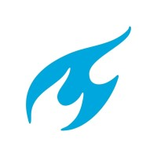
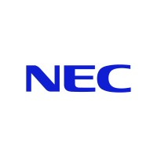
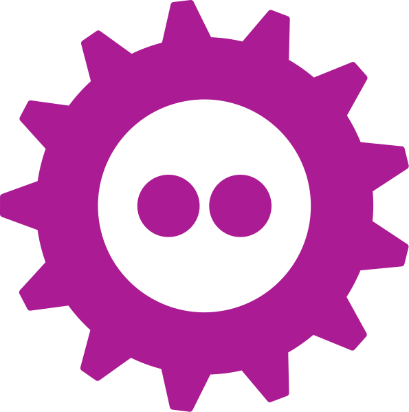
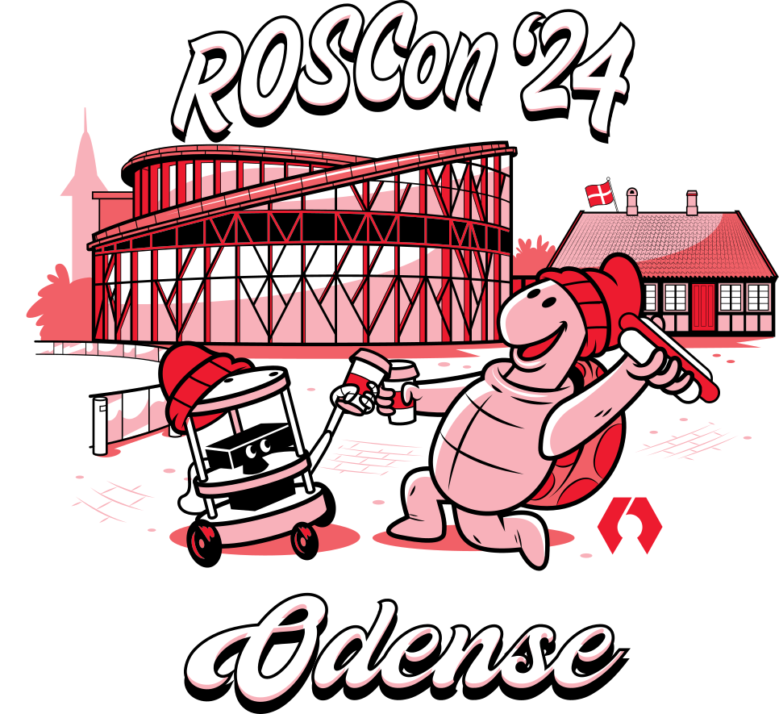
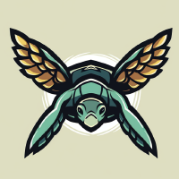

{width=200 .center}

**Kimberly N. McGuire, PhD**
___

Hi! I'm Kimberly! Originally from the Netherlands but currently I'm living in South of Sweden.  I finished my PhD at the TU Delft, MAVlab in 2019 and I'm a former developer & robotics engineer at Bitcraze.

___

## Highlights

<a href="https://youtu.be/rtgt9Z1cPas"><button style="background-color: #E8E8E8;
        border: 2px solid black;
        color: black;
        padding: 15px 32px;
        text-align: center;
        text-decoration: none;
        display: inline-block;
        font-size: 16px;
        width: 100%; 
        cursor: pointer">Robotics Developer Day talk (2024)</button></a>

 <a href="https://robotics.sciencemag.org/content/4/35/eaaw9710"><button style="background-color: #E8E8E8;
        border: 2px solid black;
        color: black;
        padding: 15px 32px;
        text-align: center;
        text-decoration: none;
        display: inline-block;
        font-size: 16px;
        width: 100%; 
        cursor: pointer">Science Robotics Paper (2019)</button></a>

## Experience

### Work

{ width="100" }{ width="100" }{ width="100" }

_2019 - 2024_: **Robotics Engineer/ Embedded Software Engineer**, _Bitcraze AB_ :se:

_2015 - 2019_: **PhD Researcher**, _Aerospace Engineering, TU Delft_ :nl:

_2013 - 2013_: **Intern** _Computational Photography Department, NEC_ :jp:

_2010 - 2010_: **Various part-time jobs in Hospitality**  _Santa Barbara_ :us:

_2009 - 2014_: **Various part-time jobs in University Support**  _TU Delft_ :nl:

### Organizations and Committees
{ width="100" }{ width="100" }{ width="100" }

<_2024 - now_: **Diversity Co-chair** [ROSCon 2024](https://roscon.ros.org/2024/) :dk:

_2024 - now_: **Organization Committee** Robotics Developer room [FOSDEM](https://fosdem.org/2025/) :be:

_2023 - now_: **Member** [Toastmasters](https://www.toastmasters.org/) :se:

_2023 - 2024_: **Organization Committee** Workshops at [ICRA](https://imrclab.github.io/workshop-uav-sims-icra2023/) :gb: and [RSS](https://imrclab.github.io/workshop-aerial-swarms-rss2024/) :nl:

_2023 - now_: **Co-lead** [ROS community group](https://github.com/ros-aerial) online

_2015 - 2018_: **Organizing Committee member** RoboCup Junior NL :nl:

### Education
{ width="100" }

_2019_: **Doctor of Philosophy**, _Department of Aerospace Engineering, TU Delft_ :nl:

_2014_: **Master of Science**, _Departement of Mechanical Engineering, TU Delft_ :nl:

_2011_: **Bachelor of Science**, _Departement of Industrial Design Engineering, TU Delft_ :nl:

 <a href="https://www.linkedin.com/in/knmcguire/"><button style="background-color: #E8E8E8;
        border: 2px solid black;
        color: black;
        padding: 15px 32px;
        text-align: center;
        text-decoration: none;
        display: inline-block;
        font-size: 16px;
        width: 100%; 
        cursor: pointer">For full list of experience, check out my LinkedIn :fontawesome-brands-linkedin:</button></a>