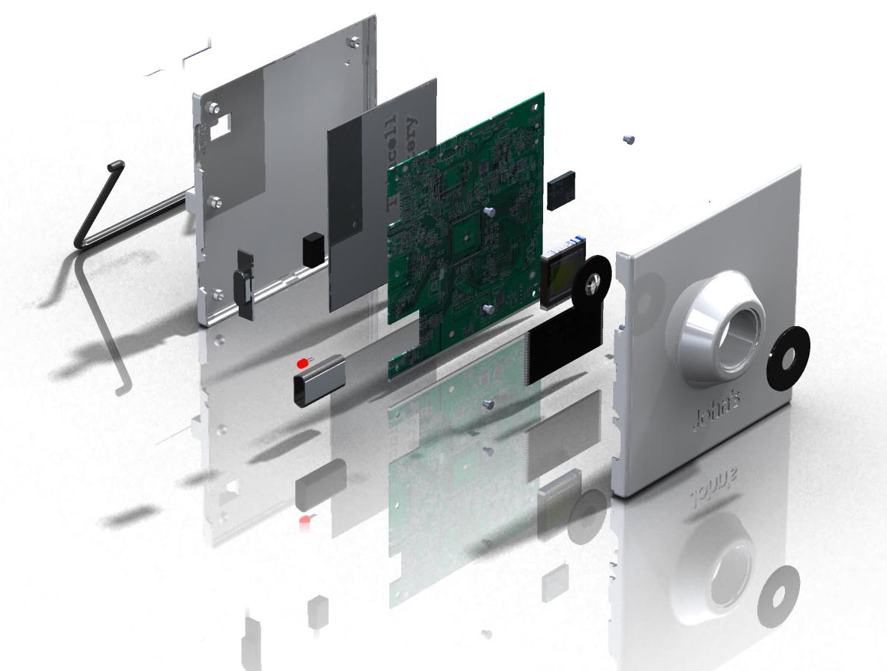

## 2019 - 2024  Robotics engineer at Bitcraze

### ROS2 Navigation with the Crazyflie 

{ width="400" align=left }

Lorem ipsum dolor sit amet, consectetur adipiscing elit. Nulla et euismod nulla. Curabitur feugiat, tortor non consequat finibus, justo purus auctor massa, nec semper lorem quam in massa. 

| Languages   |   Robotics       |  Simulation |
| ------------|---------------- |-------------|
| Python      | ROS 2           |  Gazebo     |
| C           |   Nav 2         |   Webot     |

test test

______

### Simulation of the Crazyflie 

{ width="400" align=left }

Lorem ipsum dolor sit amet, consectetur adipiscing elit. Nulla et euismod nulla. Curabitur feugiat, tortor non consequat finibus, justo purus auctor massa, nec semper lorem quam in massa. Lorem ipsum dolor sit amet, consectetur adipiscing elit. Nulla et euismod nulla. 

| Languages   |   Robotics       |  Simulation |
| ------------|---------------- |-------------|
| Python      | ROS 2           |  Gazebo     |
| C           |   Nav 2         |   Webot     |

<a href="https://www.bitcraze.io/author/kimberly/"><button style="background-color: #E8E8E8;
        border: 2px solid black;
        color: black;
        padding: 15px 32px;
        text-align: center;
        text-decoration: none;
        display: inline-block;
        font-size: 16px;
        width: 100%; 
        cursor: pointer">Written blogpost at Bitcraze</button></a>

## 2015 - 2019 - PhD Researcher at TU Delft

### Swarm Gradient Bug Algorithm

{ width="400" align=left }

Lorem ipsum dolor sit amet, consectetur adipiscing elit. Nulla et euismod nulla. Curabitur feugiat, tortor non consequat finibus, justo purus auctor massa, nec semper lorem quam in massa.

| Languages   |   Robotics       |  Simulation |
| ------------|---------------- |-------------|
| Python      | ROS 2           |  Gazebo     |
| C           |   Nav 2         |   Webot     |

____

### Autonomous pocket drone for Swarm Exploration
{ width="400" align=left }

Lorem ipsum dolor sit amet, consectetur adipiscing elit. Nulla et euismod nulla. Curabitur feugiat, tortor non consequat finibus, justo purus auctor massa, nec semper lorem quam in massa.

Blogpost: lll      
video: ....    
Paper: ....   

| Languages   |   Robotics       |  Simulation |   
| ------------|---------------- |-------------|
| Python      | ROS 2           |  Gazebo     |
| C           |   Nav 2         |   Webot     |

<a href="/projects/phd"><button style="background-color: #555555;
        border: none;
        color: white;
        padding: 15px 32px;
        text-align: center;
        text-decoration: none;
        display: inline-block;
        font-size: 16px;
        width: 100%; 
        cursor: pointer">PhD: Indoor Swarm exploration with Pocket Drones</button></a>

## 2011 - 2014 Study Final Projects - TU Delft

### MSc Final Project - Binocular Vision Stabilization

{ width="400" align=left }

Lorem ipsum dolor sit amet, consectetur adipiscing elit. Nulla et euismod nulla. Curabitur feugiat, tortor non consequat finibus, justo purus auctor massa, nec semper lorem quam in massa.

Blogpost: lll      
video: ....    
Paper: ....   

| Languages   |   Robotics       |  Simulation |   
| ------------|---------------- |-------------|
| Python      | ROS 2           |  Gazebo     |
| C           |   Nav 2         |   Webot     |

### BSc Final Project - Wearable timelapse camera

{ width="400" align=left }

Lorem ipsum dolor sit amet, consectetur adipiscing elit. Nulla et euismod nulla. Curabitur feugiat, tortor non consequat finibus, justo purus auctor massa, nec semper lorem quam in massa.

Blogpost: lll      
video: ....    
Paper: ....   

| Languages   |   Robotics       |  Simulation |   
| ------------|---------------- |-------------|
| Python      | ROS 2           |  Gazebo     |
| C           |   Nav 2         |   Webot     |

<a href="https://repository.tudelft.nl/islandora/object/uuid:3fb881d2-9701-4f1c-96a6-f6fca74aeec8?collection=education"><button style="background-color: #E8E8E8;
        border: 2px solid black;
        color: black;
        padding: 15px 32px;
        text-align: center;
        text-decoration: none;
        display: inline-block;
        font-size: 16px;
        width: 100%; 
        cursor: pointer">MSc: 
Active Binocular Vision Stabilization with a Cerebellum Inspired Model</button></a>

___

## Personal

<a href="/projects/graphic_design"><button style="background-color: #555555;
        border: 2px solid black;
        color: white;
        padding: 15px 32px;
        text-align: center;
        text-decoration: none;
        display: inline-block;
        font-size: 16px;
        width: 100%; 
        cursor: pointer">Graphic Design</button></a>
