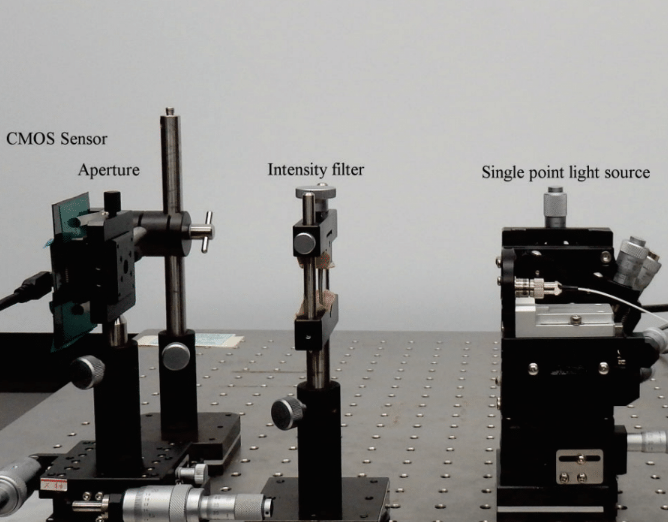

___

## ROS 2 Navigation with a nano-quadcopter 
_2022 - 2024 - Bitcraze_

{ width="300" }

During this project, I've connected a nano quadcopter with the ROS 2 framework through the Crazyswarm2 project. This allowed me to connect it to simulation, navigation packages like NAV2, or simpler mapping and navigation package strategies.

**Related Links**

* Blogposts: [:fontawesome-solid-file-lines:](https://www.bitcraze.io/2024/09/crazyflies-adventures-with-ros-2-and-gazebo/) [:fontawesome-solid-file-lines:](https://www.bitcraze.io/2022/10/crazyswarm2-development/) [:fontawesome-solid-file-lines:](https://www.bitcraze.io/2022/08/crazyflie-ros2-summer-update/) 
* Videos: [:fontawesome-solid-film:](https://youtu.be/NiQq8sAlAz4?si=4YCacfYtxWh7LLSc) [:fontawesome-solid-film:](https://youtu.be/j3qNuV6ieGQ) 

* ROSCon 2022 Presentation [:fontawesome-solid-film:](https://vimeo.com/showcase/9954564/video/767140197)  
* Robotics Developer day 2024 [:fontawesome-solid-film:](https://youtu.be/rtgt9Z1cPas) :fontawesome-solid-trophy:

        Python
        Embedded C
        Gazebo
        Webots
        ROS 2
        Nav2

______

## Robotic simulators of nano-quadcopters
_2021 - 2022 - Bitcraze_

{ width="300" }

I've built multiple models for the nano-quadcopter, the Crazyflie, creating a low-poly Collada model suitable for multi-quadcopter simulation. These have been implemented with collision models, propeller physics, and control in both Webots and the new Gazebo.

**Related Links**

* Blogposts  [:fontawesome-solid-file-lines:](https://www.bitcraze.io/2021/12/simulation-possibilities/) [:fontawesome-solid-file-lines:](https://www.bitcraze.io/2022/03/updates-on-simulation-work/) 
* ICRA 2023 Workshop on Aerial Robotics Simulation: [:fontawesome-solid-arrow-up-right-from-square:](https://imrclab.github.io/workshop-uav-sims-icra2023/)
* IEEE Robotics & Automation journal paper: [:fontawesome-solid-file-lines:](https://ieeexplore.ieee.org/document/10665978
) 

        Blender
        Python
        Embedded C
        C++17
        Gazebo
        Webots

<!--a href="https://www.bitcraze.io/author/kimberly/"><button style="background-color: #E8E8E8;
        border: 2px solid black;
        color: black;
        padding: 15px 32px;
        text-align: center;
        text-decoration: none;
        display: inline-block;
        font-size: 16px;
        width: 100%; 
        cursor: pointer">My written blogpost at Bitcraze  :fontawesome-solid-arrow-up-right-from-square: </button></a>-->

___

## Swarm Gradient Bug Algorithm
_2018 - 2019 - TU Delft_

{ width="300" }

I've researched how a swarm of tiny quadcopters can autonomously fly indoors without external positioning help. This posed a significant challenge, requiring individual quadcopters to fly independently and the swarm to communicate for coordination and avoidance. To address this, I developed SGBA, the Swarm Gradient Bug Algorithm.

**Related Links**

* Blogpost:  [:fontawesome-solid-file-lines:](https://www.bitcraze.io/2019/10/enabling-swarm-exploration/) 
* Science Robotics Publication [:fontawesome-solid-file-lines:](https://www.science.org/doi/10.1126/scirobotics.aaw9710) 
* Video Press release [:fontawesome-solid-film:](https://youtu.be/IgMKiIEbfN8?si=oXxMp5Elx2btogSD)

        Embedded C
        FreeRTOS
        ESP
        State Machines
        ROS 1
        Gazebo Classic
        ARGoS
        Matlab

___

## Autonomous pocket drone for Swarm Exploration
_2015 - 2018 - TU Delft_

{ width="300" }

Back in 2015, there was no standard platform for autonomous swarming for indoor exploration. Until the folks at Bitcraze released the right expansion decks, I had to develop my own platform for this by combining different modules together, developed internally by the engineers from MAVlab, TU Delft.

**Related Links**

* Final Experiment Video: [:fontawesome-solid-film:](https://youtu.be/yX3RoUi9D-g)   
* IEEE Robotics and Automation Letters publication:    [:fontawesome-solid-file-lines:](https://ieeexplore.ieee.org/stamp/stamp.jsp)

        Embedded C
        GPIO
        Bluetooth
        ESP
        Optical Flow
        Paparazzi
        Matlab
        FreeCAD
        3D printing

<!--a href="/projects/phd"><button style="background-color: #555555;
        border: none;
        color: white;
        padding: 15px 32px;
        text-align: center;
        text-decoration: none;
        display: inline-block;
        font-size: 16px;
        width: 100%; 
        cursor: pointer">PhD Disseration on Indoor Swarm exploration with Pocket Drones :fontawesome-solid-arrow-up-right-from-square:</button></a-->

___

## Binocular Vision Stabilization
_2014 - TU Delft_

{ width="300" }

I've developed a neural network model for the stabilization of the cameras of a binocular robotic head, based on the human cerebellum. This is based on the theory that the cerebellum processes a massive amount of sensor information and filters out the most important data for the task. This enabled the robot to more smoothly track the marker despite external disturbances, inspired by mechanisms in our own brain

**Related Links**

* MSc Final Thesis: [:fontawesome-solid-film:](https://repository.tudelft.nl/islandora/object/uuid:3fb881d2-9701-4f1c-96a6-f6fca74aeec8?collection=education)  

        C++11
        Matlab
        Solidworks
        ROS1
        Gazebo Classic
        OpenCV
        Optical Flow
        Neural Networks

___

## Coded Infrared-Cut Filter 
_2013 - 2014 - NEC_

{ width="300" }

As an intern at the NEC Corporation in Tokyo, Japan, I worked in the Information and Media Processing Labs. I focused on validating a novel high-sensitivity sensing method for computational photography. With a coded infrared cut filter, the concept could be used on regular security cameras to capture both images in the visual spectrum and infrared, which can be useful in low-light conditions.

**Related Links**

* Conference Paper at Springer CAIP conference: [:fontawesome-solid-file-lines:](https://link.springer.com/chapter/10.1007/978-3-319-23192-1_15)

        Matlab
        Diffraction Simulation
        OpenCV
        Experimental setup

___

## Wearable timelapse camera
_2011 - TU Delft_

{ width="300" }

Before switching to Mechanical Engineering, I completed my final project in Industrial Design Engineering. John's Phone is a company that made extremely simple cellphones as an anti-movement to smart iPhones. As the next product in their line, I conceptualized the 'John's Camera,' a wearable timelapse camera that can be clipped on and record the user's day.

        Solid Works
        Industrial Design
        Photoshop
        Indesign
        Assembly planning
        3D printing

